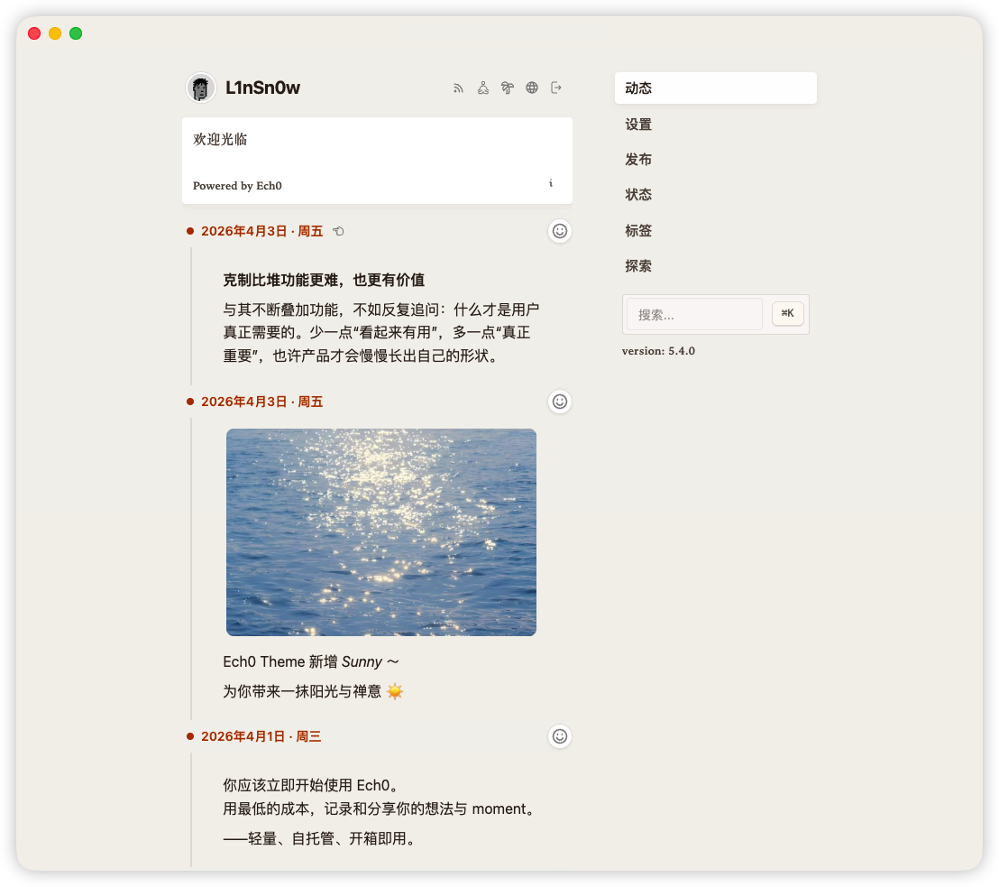

<p align="left">
  <a href="https://hellogithub.com/repository/lin-snow/Ech0" target="_blank">
    
  </a>
</p>

<p align="right">
  <a title="zh" href="./README.zh.md">
    
  </a>
  
</p>


<div align="center">
  

  [Preview](https://memo.vaaat.com/) | [Official Site & Documentation](https://www.ech0.app/) | [Ech0 Hub](https://hub.ech0.app/)

  # Ech0
</div>

<div align="center">

[](https://github.com/lin-snow/Ech0/releases)  [](https://deepwiki.com/lin-snow/Ech0) [](https://hellogithub.com/repository/lin-snow/Ech0)

</div>

> A self-hosted personal microblog where your timeline can be shared, discussed, and fully owned.

Tools like Memos are great for capturing quick thoughts. Ech0 is built for what comes next: publishing those ideas to a personal timeline that others can follow and interact with.
Run it on your own server, keep full control of your content, and keep a personal space that still feels connected through optional comments and sharing.
It stays lightweight, easy to deploy, and fully open-source.

**Great fit if you want to:**
- run a personal public or semi-public timeline on your own domain
- publish short posts, links, and media from one clean interface
- keep data ownership while still getting RSS and optional comments
- keep a personal space that supports lightweight social interaction without becoming a full social network

**Probably not for you if you need:**
- a bi-directional knowledge base workflow (for example Obsidian-style PKM)
- a team-first collaborative docs workspace (for example Notion-style docs)
- a private-only memo app with no publishing or timeline focus



---

<details>
   <summary><strong>Table of Contents</strong></summary>

- [Ech0](#ech0)
  - [Try in 60 Seconds](#try-in-60-seconds)
  - [Why Ech0](#why-ech0)
  - [Full Feature List](#full-feature-list)
  - [Quick Deployment](#quick-deployment)
    - [🐳 Docker Deployment (Recommended)](#-docker-deployment-recommended)
    - [🐋 Docker Compose](#-docker-compose)
    - [☸️ Kubernetes (Helm)](#️-kubernetes-helm)
  - [Upgrading](#upgrading)
    - [🔄 Docker](#-docker)
    - [💎 Docker Compose](#-docker-compose-1)
    - [☸️ Kubernetes (Helm)](#️-kubernetes-helm-1)
  - [FAQ](#faq)
  - [Feedback & Community](#feedback--community)
- [Open Source Governance](#open-source-governance)
  - [Project Architecture](#project-architecture)
  - [Development Guide](#development-guide)
    - [Backend Requirements](#backend-requirements)
    - [Frontend Requirements](#frontend-requirements)
    - [Start Backend & Frontend](#start-backend--frontend)
  - [Thanks for Your Support!](#thanks-for-your-support)
  - [Star History](#star-history)
  - [Acknowledgements](#acknowledgements)
  - [Support the Project](#support-the-project)

</details>

---

## Try in 60 Seconds

```shell
docker run -d \
  --name ech0 \
  -p 6277:6277 \
  -v /opt/ech0/data:/app/data \
  -e JWT_SECRET="Hello Echos" \
  sn0wl1n/ech0:latest
```

Then open `http://ip:6277`:

1. Register your first account.
2. The first account becomes Owner (admin privileges).
3. By default, publishing is restricted to privileged accounts.

See [Quick Deployment](#quick-deployment) for Docker Compose and Helm options.

## Why Ech0

- 📝 **Built for personal publishing**: Timeline-first microblog flow for thoughts, links, and short writing.  
- 🤝 **Lightweight social by design**: Posts can be shared and discussed through optional comments and interactions.  
- 🧘 **Clean reading experience**: Zen-like timeline browsing with minimal distraction.  
- ⚡ **Markdown and media in one place**: Markdown editor, rich cards, and embedded video support.  
- 🔒 **Personal first with full ownership**: Best as a personal instance with optional multi-user roles, while staying self-hosted, RSS-ready, and AGPL-3.0 open-source.  

## Full Feature List

<details>
  <summary><strong>Expand full capabilities</strong></summary>

### Highlights

- ☁️ **Lightweight, Efficient Architecture**: Low resource usage and compact images, suitable from personal servers to ARM devices.  
- 🚀 **Fast Deployment Experience**: Out-of-the-box Docker deployment from install to first run with a single command.  
- 📦 **Self-Contained Distribution**: Complete binaries and container images, with no extra runtime dependencies.  
- 💻 **Cross-Platform Support**: Supports Linux, Windows, and ARM devices (for example, Raspberry Pi).  

### Storage & Data

- 🗂️ **VireFS Unified Storage Layer**: Uses **VireFS** to unify mounting and management for local storage and S3-compatible object storage.  
- ☁️ **S3 Object Storage Support**: Native support for S3-compatible object storage for cloud resource expansion.  
- 📦 **Data Sovereignty**: Content and metadata remain user-owned and user-controlled, with RSS output support.  
- 🔄 **Data Migration Workflow**: Supports migration import for historical data and snapshot export for migration and archiving.  
- 🔐 **Automated Backup System**: Supports export/backup via Web, CLI, and TUI, plus background automatic backups.  

### Writing & Content

- ✍️ **Markdown Writing Experience**: A **markdown-it** based editing/rendering engine with plugin extension and live preview.  
- 🧘 **Zen Mode Immersive Reading**: A minimal-distraction Timeline browsing mode.  
- 🏷️ **Tag Management System**: Supports tag organization, quick filtering, and precise retrieval.  
- 🃏 **Rich Media Cards**: Supports card rendering for website links, GitHub projects, and more.  
- 🎥 **Video Content Parsing**: Supports embedded parsing/display for Bilibili and YouTube videos.  

### Media & Assets

- 📁 **Visual File Manager**: Built-in capabilities for file upload, browsing, and asset management.  

### Social & Interaction

- 💬 **Built-in Comment System**: Supports comments and moderation configuration.  
- 🃏 **Content Interaction**: Supports social interactions such as likes and sharing.  

### Auth & Security

- 🔑 **OAuth2 / OIDC Authentication**: Supports OAuth2 and OIDC for third-party login integration.  
- 🙈 **Passkey Passwordless Login**: Supports biometric or hardware security key sign-in.  
- 🔑 **Access Token Management**: Supports generating and revoking scoped tokens for API calls and third-party integration.
- 👤 **Multi-Account Permission Management**: Supports multi-user collaboration and permission control.  

### System & Developer

- 🧱 **Busen Data Bus Architecture**: Uses in-house Busen to provide decoupled module communication and reliable message delivery.  
- 📊 **Structured Logging System**: System logs are standardized in structured format for readability and analysis.  
- 🖥️ **Real-Time System Log Console**: Built-in web console for live log streams, debugging, and troubleshooting.  
- 📟 **TUI Management Interface**: Provides a terminal UI, ideal for server-side administration.  
- 🧰 **CLI Toolchain**: CLI tools for automation and script integration.  
- 🔗 **Open API & Webhook**: Full API and Webhook support for external integration and automation workflows.  

### Experience

- 🌍 **Cross-Device Adaptation**: Responsive design for desktop, tablet, and mobile browsers.  
- 🌐 **i18n Multi-Language Support**: Multi-language UI switching for different usage scenarios.  
- 👾 **PWA Support**: Installable as a web app for a more native-like experience.  
- 🌗 **Themes & Dark Mode**: Supports dark mode and theme extension.  

### License

- 🎉 **Fully Open Source**: Released under **AGPL-3.0**, with no tracking, no subscription, and no SaaS dependency.  

</details>

---

## Quick Deployment


### 🐳 Docker Deployment (Recommended)

```shell
docker run -d \
  --name ech0 \
  -p 6277:6277 \
  -v /opt/ech0/data:/app/data \
  -e JWT_SECRET="Hello Echos" \
  sn0wl1n/ech0:latest
```

> 💡 After deployment, access `ip:6277`  
> 🚷 For better security, replace `Hello Echos` in `-e JWT_SECRET="Hello Echos"` with your own secret  
> 📍 The first registered account becomes administrator (currently only admins can publish)  
> 🎈 Data is stored under `/opt/ech0/data`  

### 🐋 Docker Compose

Create a new directory and place your `docker-compose.yml` file there.

Run the following command in that directory:

```shell
docker-compose up -d
```

### 🧙 Script Deployment

```shell
curl -fsSL "https://raw.githubusercontent.com/lin-snow/Ech0/main/scripts/ech0.sh" -o ech0.sh && bash ech0.sh
```

> The script installs and manages Ech0 through systemd, so please run with root privileges when needed.
> You can run `bash ech0.sh install /your/path/ech0` to customize the install path.

### ☸️ Kubernetes (Helm)

If you want to deploy Ech0 in a Kubernetes cluster, you can use the Helm Chart provided by this project.

Since this project does not currently provide an online Helm repository, you need to clone the repository locally and install from the local directory.

1.  **Clone the repository:**
    ```shell
    git clone https://github.com/lin-snow/Ech0.git
    cd Ech0
    ```

2.  **Install with Helm:**
    ```shell
    # helm install <release-name> <chart-directory>
    helm install ech0 ./charts/ech0
    ```

    You can also customize the release name and namespace:
    ```shell
    helm install my-ech0 ./charts/ech0 --namespace my-namespace --create-namespace
    ```

---

## Upgrading

> ⚠️ Direct upgrade from v3 to v4 is not supported. Please export a snapshot in the v3 panel first, redeploy v4, then use "v3 Migration" in the v4 panel to import your existing data.

### 🔄 Docker

```shell
# Stop current container
docker stop ech0

# Remove container
docker rm ech0

# Pull latest image
docker pull sn0wl1n/ech0:latest

# Start new version
docker run -d \
  --name ech0 \
  -p 6277:6277 \
  -v /opt/ech0/data:/app/data \
  -e JWT_SECRET="Hello Echos" \
  sn0wl1n/ech0:latest
```

### 💎 Docker Compose

```shell
# Enter compose directory
cd /path/to/compose

# Pull latest image and recreate
docker-compose pull && \
docker-compose up -d --force-recreate

# Clean old images
docker image prune -f
```

### ☸️ Kubernetes (Helm)

1. **Update repository:**
   Enter your local Ech0 repository and pull latest changes.
   ```shell
   cd Ech0
   git pull
   ```

2. **Upgrade Helm release:**
   Use `helm upgrade` to update your release.
   ```shell
   # helm upgrade <release-name> <chart-directory>
   helm upgrade ech0 ./charts/ech0
   ```
   If you used a custom release name and namespace, use matching values:
   ```shell
   helm upgrade my-ech0 ./charts/ech0 --namespace my-namespace
   ```

---

## FAQ

1. **What is Ech0?**  
   Ech0 is a lightweight open-source self-hosted platform designed for quickly publishing and sharing personal thoughts, writing, and links. It provides a clean interface and distraction-free experience, with your data remaining under your control.

2. **What is Ech0 not?**  
   Ech0 is not a traditional professional note-taking app (such as Obsidian or Notion). Its core usage is closer to a social feed / microblog stream.

3. **Is Ech0 free?**  
   Yes. Ech0 is fully free and open source under AGPL-3.0, with no ads, tracking, subscriptions, or service lock-in.

4. **How do I back up and import data?**  
   Ech0 supports data recovery/migration through "Snapshot Export" and "Migration Import". At deployment level, regularly back up your mapped data directory (for example `/opt/ech0/data`). By default, core data is stored in the local database; if object storage is enabled, media assets are written to the configured storage backend.

5. **Does Ech0 support RSS?**  
   Yes. Ech0 supports RSS subscriptions so you can follow updates in RSS readers.

6. **Why does publishing fail with "contact administrator"?**  
   Publishing is restricted to privileged accounts by default. During initialization, the first account becomes Owner (with management privileges). Regular users cannot publish until explicitly granted permission by a privileged account. If this is your first setup, review [Try in 60 Seconds](#try-in-60-seconds) and confirm which account is Owner.

7. **Why is there no detailed permission matrix?**  
   Ech0 currently uses a lightweight role model (Owner / Admin / regular user) to keep operation simple and predictable. The permission model will continue to evolve based on community feedback.

8. **Why can't others see their Connect avatar?**  
   Set your current instance URL in `System Settings - Service URL`, for example `https://memo.vaaat.com` (must include `http://` or `https://`).

9. **What is the MetingAPI option in settings?**  
   It is the API endpoint used by music cards to resolve playable stream metadata. You can provide your own trusted endpoint; when left empty, Ech0 falls back to a default resolver endpoint. For production, a self-controlled endpoint is recommended.

10. **Why does a newly added Connect show only partial results?**  
    The backend tries to fetch instance information for all Connect entries. If an instance is down or unreachable, it is discarded, and only valid/accessible Connect data is returned to the frontend.

11. **How do I enable comments?**  
    Enable comments in the panel comment manager, then configure moderation and captcha toggles as needed. Ech0 now embeds `gocap` for captcha verification, so no standalone captcha service deployment is required.

12. **How do I configure S3 storage?**  
    Fill in provider, endpoint, bucket, access key, secret key, and related fields in storage settings. It is recommended to provide endpoint without `http://` or `https://`. If media is accessed directly by browsers, ensure objects are readable through your chosen policy (for example public-read or equivalent CDN/gateway setup).

13. **How do I enable passkey login?**  
    In `SSO - Passkey`, configure `WebAuthn RP ID` and `WebAuthn Origins`. After saving and seeing "Passkey ready", follow browser prompts to bind biometrics or a security key.

14. **Official statement on third-party integrations**  
    Third-party integration platforms or services that are not officially authorized by Ech0 are outside the official support scope. Any security incidents, data loss, account issues, or other risks caused by using such services are the sole responsibility of the user and the third-party provider.

15. **Where can I find detailed documentation on local vs S3 storage rules, object keys, and migration?**  
    See the in-repo [Storage migration guide](./docs/storage-migration.md). It explains how flat `key` values map to on-disk paths and S3 object keys (including `schema.Resolve` and `PathPrefix`), how stored `File.url` snapshots relate to the UI, the difference between static `/api/files` access and authenticated `stream` routes, and practical guidance for switching S3 providers or moving data between local disk and object storage.

---

## Feedback & Community

- If you encounter bugs, report them in [Issues](https://github.com/lin-snow/Ech0/issues).
- For feature ideas or improvements, join discussions in [Discussions](https://github.com/lin-snow/Ech0/discussions).
- Official QQ Group: `1065435773`

| Official QQ Community                                          | Other Groups |
| -------------------------------------------------------------- | ------------ |
|  | N/A          |

---

## Open Source Governance

- [Contribution Guide](./CONTRIBUTING.md)
- [Code of Conduct](./CODE_OF_CONDUCT.md)
- [Security Policy](./SECURITY.md)
- [License](./LICENSE)

---

## Development Guide
### Backend Requirements
📌 **Go 1.26.0+**

📌 **C Compiler**
When using CGO-dependent libraries such as `go-sqlite3`, install:
- Windows:
    - [MinGW-w64](https://winlibs.com/)
    - Add the `bin` directory to `PATH` after extraction
- macOS: `brew install gcc`
- Linux: `sudo apt install build-essential`

📌 **Google Wire**
Install [wire](https://github.com/google/wire) for dependency injection file generation:
- `go install github.com/google/wire/cmd/wire@latest`

📌 **Golangci-Lint**
Install [Golangci-Lint](https://golangci-lint.run/) for linting and formatting:
- Run `golangci-lint run` in the project root for linting
- Run `golangci-lint fmt` in the project root for formatting

📌 **Air (Optional, Backend Hot Reload)**
- Recommended via Makefile: `make air-install`
- Or install manually: `go install github.com/air-verse/air@latest`

📌 **Swagger**
Install [Swagger](https://github.com/swaggo/gin-swagger) to generate/use OpenAPI docs:
- Run `swag init -g internal/server/server.go -o internal/swagger` in project root to generate or update Swagger docs
- Visit `http://localhost:6277/swagger/index.html` in your browser to view and use docs

📌 **Event Runtime Parameters (Busen)**
- `ECH0_EVENT_DEFAULT_BUFFER` / `ECH0_EVENT_DEFAULT_OVERFLOW`
- `ECH0_EVENT_DEADLETTER_BUFFER` / `ECH0_EVENT_SYSTEM_BUFFER`
- `ECH0_EVENT_AGENT_BUFFER` / `ECH0_EVENT_AGENT_PARALLELISM`
- `ECH0_EVENT_INBOX_BUFFER`
- `ECH0_EVENT_WEBHOOK_POOL_WORKERS` / `ECH0_EVENT_WEBHOOK_POOL_QUEUE`

### Frontend Requirements
📌 **NodeJS v25.5.0+, PNPM v10.30.0+**
> Note: if you need multiple Node.js versions, use [fnm](https://github.com/Schniz/fnm) to manage them.

---

### Start Backend & Frontend
**Step 1: Backend (in Ech0 root directory)**
```shell
make run # normal backend start (equivalent to go run main.go serve)
make dev # backend hot reload with Air
```
> If dependency injection relationships change, run `wire` first in `ech0/internal/di/` to regenerate `wire_gen.go`.

**Step 2: Frontend (new terminal)**
```shell
cd web # enter frontend directory

pnpm install # run if dependencies are not installed

pnpm dev # start frontend preview
# or run from project root: make web-dev
```

**Step 3: After both are running**
Frontend preview: `http://localhost:5173` (actual port shown in terminal after start)  
Backend preview: `http://localhost:6277` (default backend port is 6277)  

> When importing packages in a layered architecture, use standardized alias names:  
> model layer: `xxxModel`  
> util layer: `xxxUtil`  
> handler layer: `xxxHandler`  
> service layer: `xxxService`  
> repository layer: `xxxRepository`  

---

## Thanks for Your Support!

Thanks to everyone who has supported this project! Your support keeps Ech0 moving forward 💡✨

|                        ⚙️ User                        |   🔋 Date   | 💬 Message                                       |
| :--------------------------------------------------: | :---------: | :---------------------------------------------- |
|                  🧑‍💻 Anonymous Friend                  |  2025-5-19   | Buy yourself a sweet drink      |
|        🧑‍💻 [@sseaan](https://github.com/sseaan)        |    2025-7-27    | Ech0 is a great thing🥳         |
| 🧑‍💻 [@QYG2297248353](https://github.com/QYG2297248353) |   2025-10-10    | None                            |
|    🧑‍💻 [@continue33](https://github.com/continue33)    |   2025-10-23    | Thanks for fixing R2            |
|    🧑‍💻 [@hoochanlon](https://github.com/hoochanlon)   |   2025-10-28    | None                            |
|       🧑‍💻 [@Rvn0xsy](https://github.com/Rvn0xsy)       |   2025-11-12    | Great project, I will keep following! |
|                     🧑‍💻 王贼臣                     |   2025-11-20    | Thanks www.cardopt.cn           |
|       🧑‍💻 [@ljxme](https://github.com/ljxme)          |   2025-11-30    | Doing my humble part 😋         |
|       🧑‍💻 [@he9ab2l](https://github.com/he9ab2l)      |   2025-12-23    | None                            |
|       🧑‍💻 鸿运当头(windfore)                          |    2026-1-6     | Thank you for creating ech0     |
|       🧑‍💻 Anonymous User                               |   2026-01-23    | None                            |
|       🧑‍💻 ABloom                                       | 2026-03-16 | ㊗️Mumuxue achieves fitness success |
|       🧑‍💻 lmscn                                        | 2026-04-01 | Support from www.lmscn.com, really like this project, hope it keeps getting better. |

---

## Star History

<a href="https://www.star-history.com/#lin-snow/Ech0&Timeline">
 <picture>
   <source media="(prefers-color-scheme: dark)" srcset="https://api.star-history.com/svg?repos=lin-snow/Ech0&type=Timeline&theme=dark" />
   <source media="(prefers-color-scheme: light)" srcset="https://api.star-history.com/svg?repos=lin-snow/Ech0&type=Timeline" />
   
 </picture>
</a>

---

## Acknowledgements

- Thanks to all users for suggestions and feedback.
- Thanks to all contributors and supporters in the open-source community.

[](https://contrib.rocks/image?repo=lin-snow/Ech0)


---

## Support the Project

🌟 If you like **Ech0**, please give this project a Star! 🚀

Ech0 is fully open-source and free. Ongoing maintenance and improvements rely on community support. If this project helps you, sponsorship is always appreciated.
You can donate via the QR code and leave your GitHub name in the note; your contribution will be displayed publicly on the `README.md` homepage.

|                  Platform                  | QR Code                                                |
| :----------------------------------------: | :----------------------------------------------------- |
| [**Afdian**](https://afdian.com/a/l1nsn0w) |  |

---

```cpp

███████╗     ██████╗    ██╗  ██╗     ██████╗
██╔════╝    ██╔════╝    ██║  ██║    ██╔═████╗
█████╗      ██║         ███████║    ██║██╔██║
██╔══╝      ██║         ██╔══██║    ████╔╝██║
███████╗    ╚██████╗    ██║  ██║    ╚██████╔╝
╚══════╝     ╚═════╝    ╚═╝  ╚═╝     ╚═════╝

```
