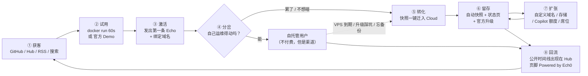
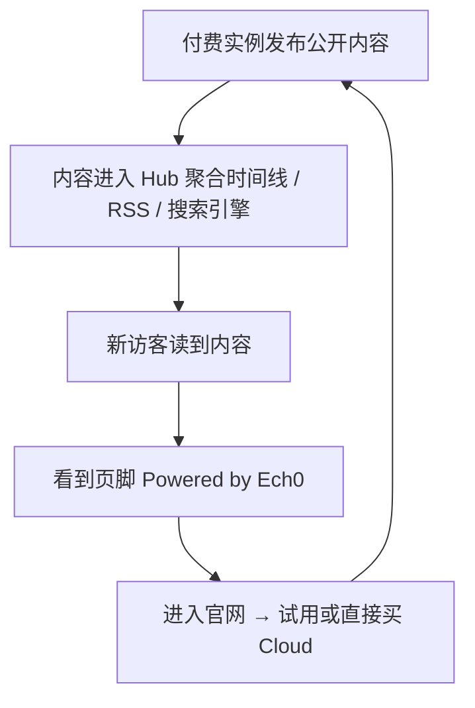
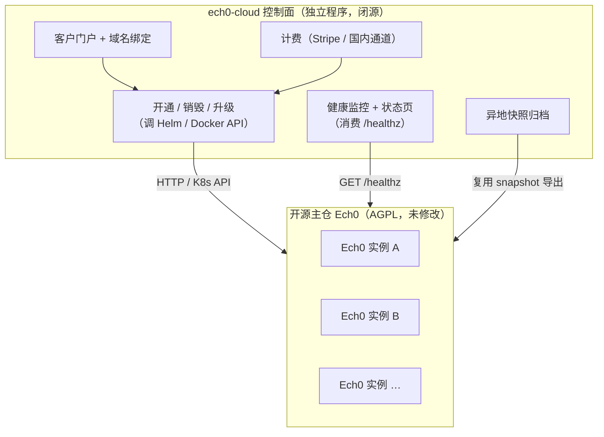
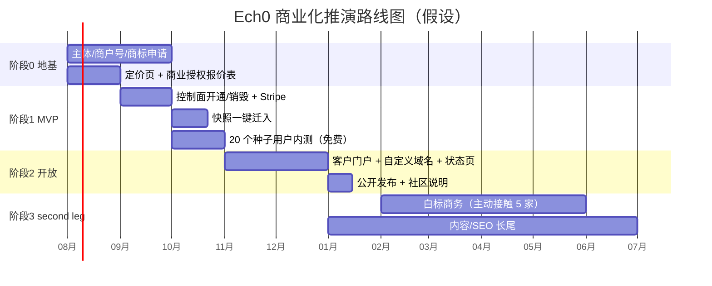

# Ech0 商业化闭环推演（假设方案）

> **这是一份沙盘推演，不是执行计划。**
> 作者当前**不打算**商业化 Ech0，也不打算创业。本文的目的是：把「如果真要靠现在这个产品跑通一整套商业闭环」这件事，从资产盘点、定位、定价、闭环设计、工程投入、单位经济模型一路推到风险与路线图，完整走一遍，体验一次 founder 的决策过程。
>
> 文中所有价格、成本、增长数字均为**估算或行业锚点**，落地前必须重新核实。文中涉及法律的判断均为常识性理解，不构成法律意见。
>
> 适用版本：Ech0 v5.4.x（2026-07）。产品事实以代码为准。

---

## 0. 一页纸（只读 30 秒看这里）

| 项 | 结论 |
| --- | --- |
| **卖什么** | 不卖软件（软件永远 AGPL 免费），卖「**不用管**」：托管、备份、域名、升级、可迁出 |
| **主力产品** | **Ech0 Cloud** — 一租户一实例（独立容器 + 独立 SQLite + 独立数据目录），不做多租户改造 |
| **定价锚** | 个人版 ¥19/月（¥190/年）；Plus ¥39/月；白标/授权 单独报价 |
| **闭环** | Hub/GitHub 获客 → `docker run` 或官方 Demo 试用 → 自托管累了 → **快照一键迁入 Cloud** → 自动快照+状态页留存 → 公开时间线回流 Hub → 再获客 |
| **护城河** | 不是功能，是**信任**：数据随时可完整导出并迁回自托管，走的是产品已有的 Snapshot 通道 |
| **主仓改动** | 极小（3 个可选口子），计费与控制面全部放**独立仓库**，不污染开源核心的轻量 |
| **盈亏平衡** | 约 **40 个付费实例**覆盖基础设施 + 固定成本（见 §8） |
| **最大风险** | 一人 on-call + 社区认为「官方托管 = 开源要变质」 |
| **第一个 go/no-go** | 6 个月内拿到 50 个付费实例且 90 天留存 > 70%，否则回到纯赞助模式 |

---

## 1. 手里有什么牌

商业化不是凭空造一个新产品，是把**已经存在的资产**重新组合成一条收钱的路径。先盘点。

### 1.1 产品资产（全部已实现）

| 资产 | 现状 | 商业价值 |
| --- | --- | --- |
| **单 Go 二进制 + 内嵌 SPA** | `cmd/ech0`，无外部运行时依赖 | 每租户一个容器的成本极低，是「一租户一实例」方案成立的前提 |
| **SQLite 单文件 + `data/` 目录** | 默认 `./data/` | 备份/迁移/销毁都是文件级操作，运维心智极简 |
| **Snapshot 导入导出（双向）** | `internal/migrator/snapshot`，Web 面板「数据管理」 | **整条商业化的信任支点**：迁入、迁出、退款、跑路保险都靠它 |
| **定时快照 + Job 框架** | `internal/task/scheduled` + `job.Manager` | 直接就是「自动备份」这个付费卖点的实现 |
| **Helm Chart** | `charts/ech0` | 控制面批量开通实例的现成执行器 |
| **`/healthz`** | `internal/router/resource.go` | Hub 已在用；也是托管侧监控与状态页的数据源 |
| **S3 / VireFS 存储抽象** | `internal/storage` + `pkg/virefs` | 媒体走对象存储，容器保持无状态-ish，扩容不痛 |
| **Access Token（scope/audience）** | `docs/dev/access-token-scope-design.md` | 集成生态与 API 计量的天然抓手 |
| **MCP Server + Webhook + OpenAPI** | `/mcp`、`internal/webhook` | 面向「把 Ech0 接进自己工作流」的高价值用户，是 Plus 档的说服力来源 |
| **Copilot（Chat / Recap）** | `internal/agent` + 向量 RAG | 目前需用户自带 LLM Key → 托管版可以「带额度」卖，是**唯一有真实边际成本、也因此定价合理的增值项** |
| **Ech0 Hub** | `hub.ech0.app`，聚合公开实例时间线 | 天然的增长回路入口（§6.5），也是最容易被商业化毁掉的东西（§11.3） |
| **i18n 4 语言 + PWA + 主题** | `web/src/locales` | 海外市场无需额外产品投入即可尝试 |

### 1.2 非产品资产

- **AGPL-3.0-or-later + 已有 `COMMERCIAL.md`**：双许可的口子已经开好，白标/闭源分发的收费通道在法律形态上已存在。
- **著作权集中在作者本人**：商业授权可以自己决定。（一个小提示：`NOTICE` 写的是 "L1nSn0w and contributors"，若日后真要对外签**商业授权合同**，涉及他人贡献的代码段建议要么走 CLA、要么确认其可授权性 —— 本文其余部分不再展开。）
- **既有社区**：GitHub Star / Docker Pulls / QQ 群 / 爱发电赞助页 / HelloGitHub 推荐位。这是零成本获客渠道，也是最容易被激怒的一群人。
- **一人团队**：这是最硬的约束，见下。

### 1.3 硬约束（写在最前面，后面所有方案都不许违背）

1. **一个人**。没有客服班次，没有 on-call 轮换。任何承诺 99.9% + 1 小时响应的方案都是自杀。
2. **轻量原则**。Ech0 的核心竞争力是「小、快、装完就能用」。任何为了收钱而让开源核心变重的改动，一票否决。
3. **安稳体感**。用户要的是「放着不管也不会出事」。商业化不能引入打扰（弹窗升级提示、试用倒计时、默认开启的遥测）。
4. **不背叛已开源的部分**。今天免费的功能，明天不能变成付费墙。这条一旦破，社区信任归零，而社区就是获客渠道本身。

---

## 2. 定位：到底卖什么

### 2.1 一句话

> **Ech0 永远免费开源；我们卖的是「你不用自己运维它」。**

这句话必须能同时被两拨人接受：
- 自托管硬核用户：听完不觉得被背叛（软件没变）；
- 想付钱的人：听完知道自己买的是什么（时间和确定性）。

### 2.2 买家画像（按付费意愿排序）

| # | 画像 | 痛点 | 愿意付 | 从哪来 |
| --- | --- | --- | --- | --- |
| 1 | **想要个人时间线、但不想碰服务器的写作者/创作者** | 不会 Docker、不会证书、怕丢数据 | ¥19–39/月 | Hub、社交平台、搜索「个人微博 自托管」 |
| 2 | **自托管过、但受够了的开发者** | VPS 到期、升级踩坑、忘了备份 | ¥19/月（心疼但认） | GitHub Issues / Discussions 里的运维求助帖 |
| 3 | **小团队 / 工作室 / 社群**（对外发布动态页） | 要域名、要多人、要能对外看 | ¥39–99/月 | 口碑、Hub |
| 4 | **集成商 / 想做白标产品的公司** | 要闭源分发、去 attribution | 一次性 ¥1w–5w 或年费 | `COMMERCIAL.md` 现有入口、邮件 |
| 5 | **重度用户（爱这个项目）** | 只是想支持 | 赞助 ¥10–100/月 | 爱发电，已存在 |

> **Founder 决策点**：#1 和 #2 是同一套产品（Cloud），先做。#3 是 Cloud 的高价档，几乎零额外开发。#4 是纯商务，零开发但吃时间。#5 已经在跑，不动。

### 2.3 对手与锚点

| 参照物 | 形态 | 价格锚（**需复核**） | 对 Ech0 的启示 |
| --- | --- | --- | --- |
| Memos | 开源自托管，无官方托管 | 免费 | 证明这个用户群存在；也证明「只开源不托管」拿不到钱 |
| Micro.blog | 托管个人微博 | ~$5–10/月 | 与 Ech0 Cloud 最接近的形态，价格带印证 ¥19–39 合理 |
| Ghost(Pro) | 托管开源博客 | ~$9–25/月起 | 「开源软件 + 官方托管」的经典范式，且社区未反弹 —— 抄它的姿势 |
| Bear / Write.as 等极简博客 | 托管 | ~$5/月或年付更低 | 低价档的下限参考 |

**结论**：Ech0 Cloud 定 ¥19/月（约 $2.7）在国内偏舒适、在海外偏便宜。海外单独定 $5/月更合理（§5.3）。

---

## 3. 红线：先定不做什么

商业化最容易毁掉的不是代码，是产品的性格。以下写死：

| 红线 | 为什么 |
| --- | --- |
| ❌ 不把已开源的功能改成付费 | 违背 §1.3.4，社区信任一次性归零 |
| ❌ 不在开源版塞广告 / 升级弹窗 / 试用倒计时 | 违背「安稳体感」 |
| ❌ 不默认开启任何遥测 | 自托管用户选 Ech0 就是为了没有这个 |
| ❌ 不做「开源版故意难用」（阉割备份、限制条数） | 这是 open-core 最常见的自杀方式 |
| ❌ 不卖用户数据、不训练模型 | 不解释 |
| ❌ 不做数据锁定 | 恰恰相反，**能迁出**是卖点（§6.4） |
| ❌ 不为了企业功能重构成多租户 | 违背轻量原则，且技术风险与收益不成比例（§7.1） |
| ⚠️ Hub 排序不可购买 | 见 §11.3 |

> 反过来说，**允许**的商业化形态只有三类：
> ① 卖运维与托管（服务，不是软件功能）；
> ② 卖有真实边际成本的资源（LLM 额度、存储、带宽）；
> ③ 卖法律权利（商业授权 / 白标 / 去 attribution）。
> 这三类都不需要动开源核心的功能边界。

---

## 4. 收入结构：四条腿

按「落地成本 ÷ 预期收入」排序：

### A. Ech0 Cloud（托管）— 主力，占预期收入 70%

- **形态**：一租户一实例。用户注册 → 控制面用 Helm/Docker 起一个独立 Ech0 容器 → 分配 `xxx.ech0.host` 子域名 → 用户登录即用。
- **为什么不做多租户**：见 §7.1，这是本方案最重要的一个工程判断。
- **交付的具体价值**：自动 HTTPS、自定义域名、每日自动快照 + 异地保留、版本升级由官方执行、状态页、随时一键导出全量快照。

### B. 增值资源包 — 占 20%

不是功能墙，是**有成本的资源**：

| 项 | 说明 | 为什么可以收 |
| --- | --- | --- |
| **Copilot 额度** | 托管版内置 LLM，用户不必自带 Key | 真实 token 成本，按量计价天然合理 |
| **存储包** | 超出基础额度的媒体存储 | 真实 S3 成本 |
| **额外备份保留期** | 30 天 → 365 天版本历史 | 真实存储成本 |
| **多用户席位** | 一个实例内多个账号（产品已支持 Owner/Admin/User） | 团队场景，零开发 |

### C. 商业授权 / 白标 — 占 8%，但现金流形态最好

- 通道已在 `COMMERCIAL.md`。要补的只是：**定价表 + 标准合同模板 + 一个能回邮件的地址**（现在只有 GitHub Discussions，太不专业）。
- 典型客户：想把 Ech0 嵌进自家产品、又不想开源修改的公司。
- 定价：年费 ¥19,800 起（含去 attribution + 闭源修改权 + 邮件支持），永久买断 ¥58,000 起（**需复核，此为市场感觉价**）。
- 特点：一年可能只成 1–3 单，但一单顶几十个 Cloud 用户，且不占运维时间。

### D. 赞助 / 支持合约 — 占 2%，但战略意义大

- 保留现有爱发电（`SPONSOR.md`）。
- 新增「企业支持合约」：不托管，只买**优先响应 + 升级咨询 + 私有部署答疑**，¥6,000/年。适合已经自托管的机构。

### 排除项

广告、数据变现、抽成用户内容、强制账号体系 —— 全部不做，理由见 §3。

---

## 5. 定价

### 5.1 Cloud 价目表（国内，人民币）

| 档位 | 价格 | 包含 | 目标画像 |
| --- | --- | --- | --- |
| **Free Trial** | 14 天，无需信用卡 | 全功能，子域名 | 所有人 |
| **个人版** | **¥19/月** 或 **¥190/年**（省 2 个月） | 1 实例、1 用户、5 GB 存储、每日快照保留 30 天、子域名 | 画像 #1 #2 |
| **Plus** | **¥39/月** 或 **¥390/年** | 个人版 + 自定义域名、20 GB、快照保留 180 天、Copilot 基础额度、Webhook/MCP 托管出口 | 画像 #2 #3 |
| **团队版** | **¥99/月** | Plus + 5 席位、50 GB、快照保留 365 天、优先支持 | 画像 #3 |
| **加购** | 存储 ¥5/10GB/月；Copilot 额度包 ¥19/月起 | | |

### 5.2 定价逻辑（founder 自问自答）

- **为什么不是 ¥9？** 太便宜会吸引来「最挑剔 + 最不愿看文档」的用户群，而一人团队最贵的成本是支持时间，不是服务器。¥19 是一个「认真想用」的过滤器。
- **为什么不是 ¥49？** 因为软件本身免费开源，用户随时可以 `docker run` 走人。定价必须显著低于「用户自己买 VPS + 花时间运维」的心理成本（一台入门 VPS 已 ¥20–40/月），否则闭环断掉。**¥19 的隐含论证是：比你自己买 VPS 还便宜，而且我帮你备份。** 这是整个定价表的核心。
- **为什么年付打折 2 个月？** 一人团队最怕现金流波动和月度流失，年付把留存问题一次性解决 10 个月。
- **免费额度给不给？** 不给永久免费档。永久免费在这个成本结构下（每租户一个常驻容器）会被白嫖到死，且免费用户提的支持工单最多。用 14 天试用 + 永远免费的自托管版本兜住「我就想白嫖」的需求 —— 这是 Ech0 独有的优势：**我们的免费档是开源软件本身。**

### 5.3 海外定价

不做汇率换算，做市场定价：**$5 / $12 / $29 per month**。理由：$2.7 在海外用户眼里是「不可信的便宜」，反而降低转化。支付走 Stripe，与国内通道分开（§7.4）。

---

## 6. 商业闭环全景

「闭环」= 一个陌生人从第一次听说，到付费，到续费，到帮你带来下一个陌生人的完整回路。Ech0 的特殊之处在于：**这个回路的每一环都能用产品里已经存在的东西兑现**。



### 6.1 ① 获客：零预算，靠已有渠道

| 渠道 | 现状 | 要做的事 |
| --- | --- | --- |
| GitHub | Star / Issues / Discussions | README 顶部加一行「不想自己运维？→ Ech0 Cloud」（**一行，不做横幅**） |
| Ech0 Hub | 已聚合公开实例 | 页脚一句中性的 "Host your own"，不做排序倾斜 |
| 搜索 | `site/` 已是官方站 | 补 3 篇长尾内容：「Memos vs Ech0」「自托管微博怎么选」「如何备份自托管数据」 |
| RSS | 产品自带 | 每个公开实例都是一个内容节点，长期是最稳的 SEO 来源 |
| 社群 | QQ 群 / HelloGitHub | 不推销，只答疑；转化靠 §6.4 的时机 |

**关键洞察**：不需要买量。这个产品的获客是**内容驱动**的 —— 每个用户发的每条公开 Echo 都是一个带 `Powered by Ech0` 页脚的着陆页。

### 6.2 ② 试用：两条路，都不需要注册

- `docker run` 一条命令（README 已有「Try in 60 Seconds」）；
- 官方 Demo（已有 `memo.vaaat.com` 形态）。

**不做「注册后才能看」**。这个产品群体一旦被要求先注册就会关页面。

### 6.3 ③ 激活：定义清楚「激活」是什么

激活 = **发出第一条 Echo + 绑定了自己的域名**。只有绑了域名的人才会长期留下来，因为域名意味着他把这里当成了「自己的地方」。所以 Cloud 的 onboarding 只有两个必做步骤，其余全部往后放。

### 6.4 ⑤ 转化：把「迁入」做成一次点击

这是整条链路上**唯一需要新写代码**的关键体验，也是最值钱的一段。

```
自托管实例 →「数据管理」导出快照 zip → Cloud 注册页上传 → 控制面起实例并导入 → 完成
```

产品侧完全复用已有的 Snapshot 导入导出（`internal/migrator/snapshot`，`ech0` 格式已支持自身回环）。控制面只需要：接收 zip → 起容器 → 调导入。

**转化时机**（何时出现在用户面前）：
- 他在 Issues 里发运维求助帖时（人工回复末尾一句）；
- 他的实例在 Hub 健康检查里连续掉线时（Hub 已有掉线原因展示，可以对实例主人发一封提醒邮件 —— 但**必须是他主动登记过邮箱**，否则就是骚扰）；
- 官方站的「备份」相关文章末尾。

### 6.5 ⑧ 回流：产品自带的增长飞轮



这是 Ech0 比一般 SaaS 幸运的地方：**它的用户产出的是公开内容，而公开内容天然是获客资产**。Hub 的存在让这个飞轮不依赖单个实例的流量。

代价：Hub 必须保持中立，一旦被用来给付费用户导流，飞轮的燃料（自托管用户愿意登记）就没了。见 §11.3。

---

## 7. 要补的工程（以及如何不污染开源核心）

### 7.1 最重要的判断：**不做多租户**

诱惑是显然的：一个进程服务 1000 个用户，成本最低。但：

| 维度 | 一租户一实例 | 改造成多租户 |
| --- | --- | --- |
| 开源核心改动 | **零** | 几乎重写数据层：所有查询加 tenant 维度、鉴权、存储 key 前缀、事件、Job、向量索引 |
| 风险 | 故障半径 = 1 个用户 | 一个越权 bug = 全量数据泄露 |
| 备份/迁出 | 就是那个 `data/` 目录，快照现成 | 需要单独写导出器 |
| 违背轻量原则 | 否 | **是**（一票否决） |
| 成本 | 每租户约 ¥3–8/月（§8） | 更低，但省下的钱远小于开发与风险成本 |

> **Founder 决策**：一租户一实例。省下来的几个月开发时间，比省下来的服务器钱值钱得多。而且这个选择直接支撑了「随时可迁出」的信任叙事 —— 因为迁出的就是那个完整目录。

### 7.2 主仓（开源）只允许这 3 处改动

全部对自托管用户**同样有用**，且默认不开启：

| # | 改动 | 对自托管用户的价值 | 是否变重 |
| --- | --- | --- | --- |
| 1 | `ech0 snapshot export/import` CLI 子命令 | 无需开面板即可脚本化备份 | 否（复用现有 migrator） |
| 2 | `/healthz` 扩展只读运行指标（版本、实例启动时间、存储用量） | 自托管也想知道自己用了多少 | 否 |
| 3 | 品牌/attribution 相关字段做成**配置项** | 自托管本来就可以改（AGPL 允许） | 否 |

> 注意 #3：这**不是**功能墙。AGPL 下用户本来就有权修改，配置化只是省去 fork。商业授权卖的是「不必公开你的修改」这个法律权利，与代码是否可配置无关。

### 7.3 其余全部放独立仓库 `ech0-cloud`（闭源）



**为什么这样切**：
1. 主仓保持轻量（§1.3.2），社区看不到任何「商业化痕迹」；
2. 控制面是**独立程序**，通过网络 API 与未修改的 Ech0 交互，不与其构成同一程序，因此不被 copyleft 传染；
3. 托管的是**未修改的上游 Ech0**，AGPL 要求向服务使用者提供对应源码 —— 直接指向 GitHub 上游即可，合规成本≈0。（正式落地前请律师确认。）

### 7.4 支付通道

| 市场 | 通道 | 备注 |
| --- | --- | --- |
| 海外 | Stripe（订阅 + Customer Portal） | 退款、发票、税（Stripe Tax）都能托管掉，一人团队的正确选择 |
| 国内 | 微信支付 / 支付宝（需公司主体）；过渡期可用爱发电 | 个人身份拿不到商户号是真实门槛，见 §10.4 |

### 7.5 工程量估算（一人）

| 阶段 | 内容 | 估时 |
| --- | --- | --- |
| MVP | 控制面开通/销毁 + 子域名 + Stripe 订阅 + 快照迁入 | 3–4 周 |
| 可运营 | 客户门户、自定义域名 + 证书、自动快照归档、状态页 | 3 周 |
| 可放心睡觉 | 监控告警、故障自愈、扩容脚本、退款/销毁流程 | 2 周 |
| **合计** | | **约 8–9 周**（不含内容与商务） |

---

## 8. 单位经济模型

### 8.1 单租户边际成本（估算，**参数请按实际替换**）

假设：一台 4C8G VPS 月租 ¥160；Ech0 空闲实例常驻内存按 120 MB 估、允许一定超售；每台机器跑 40 个实例。

| 成本项 | 单租户/月 | 说明 |
| --- | --- | --- |
| 计算 | ¥4.0 | ¥160 ÷ 40 |
| 对象存储（媒体 5 GB） | ¥0.7 | 按 R2/S3 兼容低价方案，出网费按零/极低估 |
| 快照归档（30 天版本） | ¥0.5 | 增量小，SQLite + 媒体引用 |
| 带宽/CDN | ¥1.0 | 个人时间线流量普遍很小 |
| 支付手续费 | ¥0.7 | 约 3.5% × ¥19 |
| **合计** | **≈ ¥6.9** | |

**个人版毛利率 ≈ (19 − 6.9) / 19 ≈ 64%**。Plus 档因为成本几乎不变、价格翻倍，毛利率 ≈ 82%。

> Copilot 额度是唯一会显著抬高成本的项，因此**必须单独计价、必须设硬上限**，不能塞进基础档。

### 8.2 固定成本

| 项 | 月成本（估） |
| --- | --- |
| 控制面主机 + 数据库 | ¥100 |
| 域名 / 证书 / 邮件服务（事务邮件） | ¥60 |
| 状态页 / 监控 | ¥50 |
| 备份异地存储 | ¥80 |
| 杂项（工商、账务、工具订阅） | ¥300 |
| **合计** | **≈ ¥590/月** |

### 8.3 盈亏平衡

```
每个个人版贡献毛利 ≈ ¥12.1/月
覆盖固定成本所需 ≈ 590 ÷ 12.1 ≈ 49 个个人版
若客户结构为 70% 个人版 + 30% Plus（毛利 ¥32）：
  加权毛利 ≈ 0.7×12.1 + 0.3×32 ≈ ¥18.1
  盈亏平衡 ≈ 590 ÷ 18.1 ≈ 33 个付费实例
```

**结论：33–49 个付费实例覆盖成本。** 这个数字小得可以接受 —— 它意味着这门生意在很小的规模上就不亏钱，但也意味着**它很难养活一个人**：

| 付费实例数 | 月毛利 | 减固定成本 | 年化 |
| --- | --- | --- | --- |
| 50 | ¥905 | ¥315 | ¥3.8k |
| 200 | ¥3,620 | ¥3,030 | ¥36k |
| 500 | ¥9,050 | ¥8,460 | ¥102k |
| 1,000 | ¥18,100 | ¥17,510 | ¥210k |

> **Founder 的清醒时刻**：要靠 Cloud 拿到「一份工资」，需要约 **500–1000 个付费实例**。对一个自托管微博工具来说，这需要数万级的活跃自托管基数。**这正是 §4.C 商业授权那条腿存在的意义**：一年成 2 单白标（¥4w）≈ 200 个 Cloud 用户一年的毛利，且不增加任何运维负担。
>
> 所以真实的资源分配应该是：**Cloud 用来建立信任与规模，白标用来赚钱。** 大多数把开源做成生意的人最后都会得到这个结论。

---

## 9. 运营：一个人能承诺什么

诚实地写进 SLA，而不是抄大厂模板：

| 承诺项 | 写什么 | 不写什么 |
| --- | --- | --- |
| 可用性 | 「目标 99.5%，不提供赔付」 | ❌ 99.99% + 赔偿条款 |
| 支持响应 | 「工作日 24 小时内首次响应」；团队版 8 小时 | ❌ 7×24 |
| 数据安全 | 「每日自动快照 + 异地保留 N 天 + 你随时可自行导出全量」 | ❌ 「绝不丢失」 |
| 迁出 | 「任何时候可导出完整快照，导入自托管版本」，写进定价页正面 | —— |
| 停服 | 「若服务终止，提前 90 天通知并提供全量导出 + 自托管迁移指引」 | —— |

最后两条是**反直觉但正确**的：把「你随时可以离开」写在最显眼的地方，转化率会上升。因为这个用户群买的就是掌控感，而竞争对手（大平台）恰恰给不了。

**支持渠道收敛**：只留一个邮箱 + 一个工单入口。不开 IM 群做付费支持 —— 那是一人团队时间的黑洞。

---

## 10. 法务与合规要点（非法律意见）

1. **托管未修改的 Ech0**：AGPL 要求向网络服务使用者提供对应源码。托管的是上游未修改版本 → 在页脚给出源码链接与版本号即可。**一旦为 Cloud 修改了 Ech0 本体（哪怕只是加个 feature flag），这些修改就必须以 AGPL 公开。** 这是 §7.2「主仓改动必须同时对自托管有用」这条规则的深层原因 —— 反正要公开，不如一开始就当开源功能做。
2. **控制面闭源**：独立进程 + 网络 API 交互，通常不构成 AGPL 意义上的同一程序。落地前找律师确认。
3. **商标**：`Ech0` 名称与 Logo 建议单独注册。商业授权里最有价值的往往不是代码权利，而是**能不能用这个名字**。同时也是防止他人拿 AGPL 代码起一个同名托管服务的唯一手段（AGPL 拦不住他，商标可以）。
4. **主体与支付**：国内收款需要公司/个体户主体 + 微信/支付宝商户号；海外 Stripe 需要可支持的主体。这一步是纯行政成本，但会卡住时间线 4–8 周，路线图里必须留出来（§12 阶段 0）。
5. **隐私**：托管即处理用户数据 → 需要隐私政策、数据处理说明；面向欧盟用户需考虑 GDPR（数据所在地、删除权 —— 好消息是「删除」在本架构里就是删一个目录）。
6. **发票与税**：国内开票、海外 Stripe Tax 代收代缴。别手工做。

---

## 11. 风险与失败模式

### 11.1 一人 on-call（**最高风险**）

- 症状：一次凌晨的存储故障就能毁掉全部口碑。
- 缓解：① 一租户一实例天然限制故障半径；② 每日异地快照 = 最坏情况下可全量重建；③ SLA 只承诺 99.5% 且无赔付；④ 规模超过约 300 实例就必须自动化或找人，否则主动停止获客。
- **止损线**：如果连续两个月每周运维时间 > 8 小时，说明架构或规模不对，缩回去。

### 11.2 社区反弹

- 症状：「开源要变质了」出现在 Issues / 论坛。
- 缓解：发布前先写一篇公开说明，明确 §3 的红线清单，并且**说到做到**。README 里的 Cloud 入口只放一行文字。永远保证自托管版本功能完整、优先更新。
- 判断标准：如果一个功能只有 Cloud 有、自托管没有，除非它本质上是**服务**（如异地备份、状态页），否则就是踩线。

### 11.3 Hub 中立性受损

- 症状：自托管用户不再愿意把实例登记进 Hub，飞轮燃料枯竭。
- 缓解：Hub 排序算法公开、不可购买；付费用户在 Hub 上**不获得任何曝光优势**；Hub 的注册流程保持 GitHub Issue 驱动（现有机制，透明可审计）。

### 11.4 「用户随时能走」导致流失

- 反直觉的现实：这个风险被高估了。真正会走的用户本来就不该是你的客户。可迁出带来的转化提升 > 流失损失。
- 真正要防的是**沉默流失**（信用卡过期、忘记续费导致数据被删）。所以：过期后数据保留 60 天 + 三次邮件提醒 + 一键导出链接，比任何挽留弹窗都有效。

### 11.5 增长天花板

- 现实：自托管微博是小众市场。Cloud 单腿走不到「养活自己」（§8.3）。
- 缓解：把白标/授权当作第二曲线，而不是「顺便挂个页面」。主动去接触 3–5 个可能的集成商，比优化 Cloud 落地页的转化率更有杠杆。

---

## 12. 12 个月路线图（含 go/no-go 门槛）



| 门槛 | 时点 | 通过标准 | 不通过怎么办 |
| --- | --- | --- | --- |
| **G1 需求验证** | 阶段 1 末 | 20 个内测里 ≥ 10 个愿意在收费后继续用 | 停。回到纯赞助模式，本文归档 |
| **G2 转化验证** | 公开发布 + 3 个月 | ≥ 50 个付费实例 | 只保留白标一条腿，Cloud 降级为「邀请制」 |
| **G3 留存验证** | 公开发布 + 6 个月 | 90 天留存 > 70%，月运维 < 8h/周 | 暂停获客，先修产品或自动化 |
| **G4 可持续** | 12 个月 | 覆盖固定成本 + 至少 1 单白标成交 | 决定是长期副业还是彻底关掉（关掉也要走 §9 的 90 天停服承诺） |

---

## 13. 指标看板（一周只看 5 个数）

| 指标 | 定义 | 为什么是它 |
| --- | --- | --- |
| ⭐ **北极星：活跃付费实例数** | 过去 7 天有发布行为的付费实例 | 同时包含「付费」和「真的在用」，比 MRR 更早预警流失 |
| 激活率 | 试用中「发第一条 + 绑域名」的比例 | §6.3 的定义，onboarding 质量的唯一指标 |
| 90 天留存 | 付费后第 90 天仍在订阅 | 这门生意的生死线 |
| 每周运维时长 | 自己记 | 一人团队的真实产能约束，超了就是规模不对 |
| 自托管活跃实例数 | Hub 健康检查 + 可选上报 | 渠道储量。它才是 Cloud 的用户池 |

**不看的指标**：GitHub Star、注册数、页面 PV。它们不预测收入，只提供情绪价值。

---

## 14. Founder 的一周（模拟体感）

既然是体验，那把「成为 founder 之后一周长什么样」也写清楚：

| 时间 | 事 | 感受 |
| --- | --- | --- |
| 周一上午 | 看 5 个数（§13），处理周末攒下的 3 封工单 | 其中 1 封是「我忘了密码」，1 封是「能不能支持 XX」，1 封是真 bug |
| 周一下午 | 修那个真 bug，同时它也是开源版的 bug | 商业化最好的副作用：付费用户帮你找 bug |
| 周二 | 写一篇长尾内容（「自托管数据怎么备份才算安全」） | 这是最没成就感、但复利最高的两小时 |
| 周三 | 回一封白标询价邮件，报价 + 发合同模板 | 心跳加速。这一单顶三个月的 Cloud 收入 |
| 周四 | 做控制面的自动化（省未来的自己） | 唯一像「写代码」的一天 |
| 周五 | 一个实例存储满了，用户在群里 @ 你 | 你意识到自己再也不能随便消失一周了 |
| 周末 | 想开发新功能，但发现最该做的是把工单模板写好 | **这就是从「作者」变成「founder」的那一刻** |

最重要的一条体验：**商业化之后，你不再是这个项目最自由的人。** 每加一个付费用户，你的可选项就少一点。这个代价是否值得，是 §12 的 G4 真正要回答的问题 —— 而不是钱够不够。

---

## 附录 A：不做清单（贴墙上）

- 不做多租户改造
- 不做功能墙
- 不做默认遥测
- 不做广告
- 不承诺 99.9% / 7×24
- 不开付费支持 IM 群
- 不买量
- 不让 Hub 排序可购买
- 不在 README 放横幅

## 附录 B：前 20 个客户从哪来（可执行清单）

1. GitHub Issues / Discussions 里出现过运维求助的人（逐个私信，免费给 3 个月）
2. Hub 上健康检查频繁掉线的实例主人（说明他运维吃力）
3. QQ 群里问过「怎么备份」的人
4. 爱发电已有赞助者（他们已经证明了付费意愿）
5. 官网 Demo 的深度访问者（停留 > 2 分钟）
6. 长尾文章「Memos 迁移到 Ech0」的读者

> 前 20 个必须**手工获取、手工 onboarding、手工要反馈**。自动化留到 50 个之后。

## 附录 C：定价页文案草稿

> ### Ech0 永远免费开源。
> 你可以现在就 `docker run` 起来，一分钱不花，功能一个不少。
>
> **Ech0 Cloud 卖的是另一样东西：你不用管它。**
> 自动 HTTPS、自动升级、每天自动快照并存到另一个地方。
>
> **而且你随时可以走。**
> 一键导出完整快照，导入你自己的服务器，数据一条不少。
> 我们不做数据锁定 —— 因为我们的软件本来就是你的。
>
> **¥19/月**　起 · 14 天免费试用 · 无需信用卡

---

## 相关文档

- [`COMMERCIAL.md`](../../COMMERCIAL.md) — 现有商业授权说明（本文 §4.C 的落地入口）
- [`docs/legal/agpl-compliance.md`](../legal/agpl-compliance.md) — AGPL 合规指引（本文 §10 的基础）
- [`docs/dev/snapshot-design.md`](../dev/snapshot-design.md) — 快照设计（本文 §6.4 迁入迁出的实现基础）
- [`docs/dev/architecture-overview.md`](../dev/architecture-overview.md) — 架构全景（本文 §7 工程判断的依据）
- [`SPONSOR.md`](../../SPONSOR.md) — 现有赞助通道（本文 §4.D）
