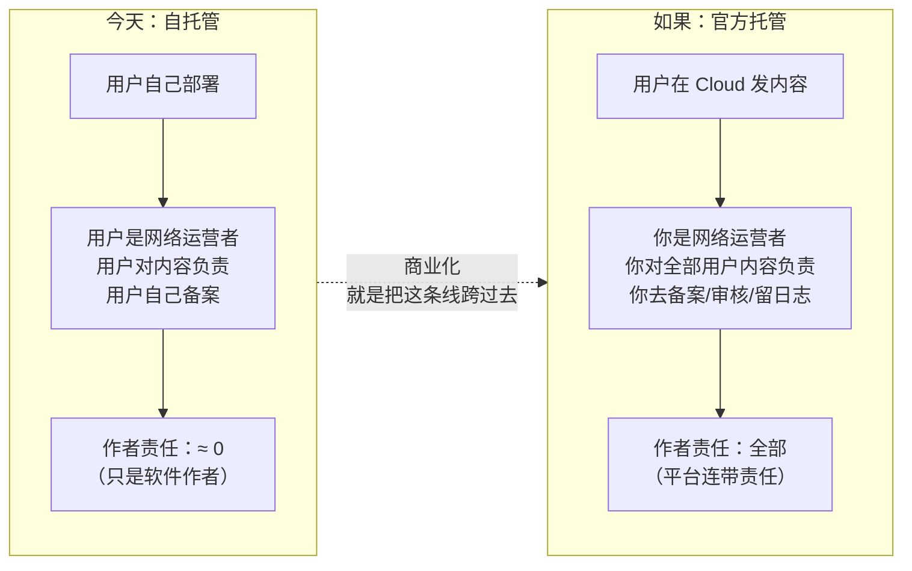
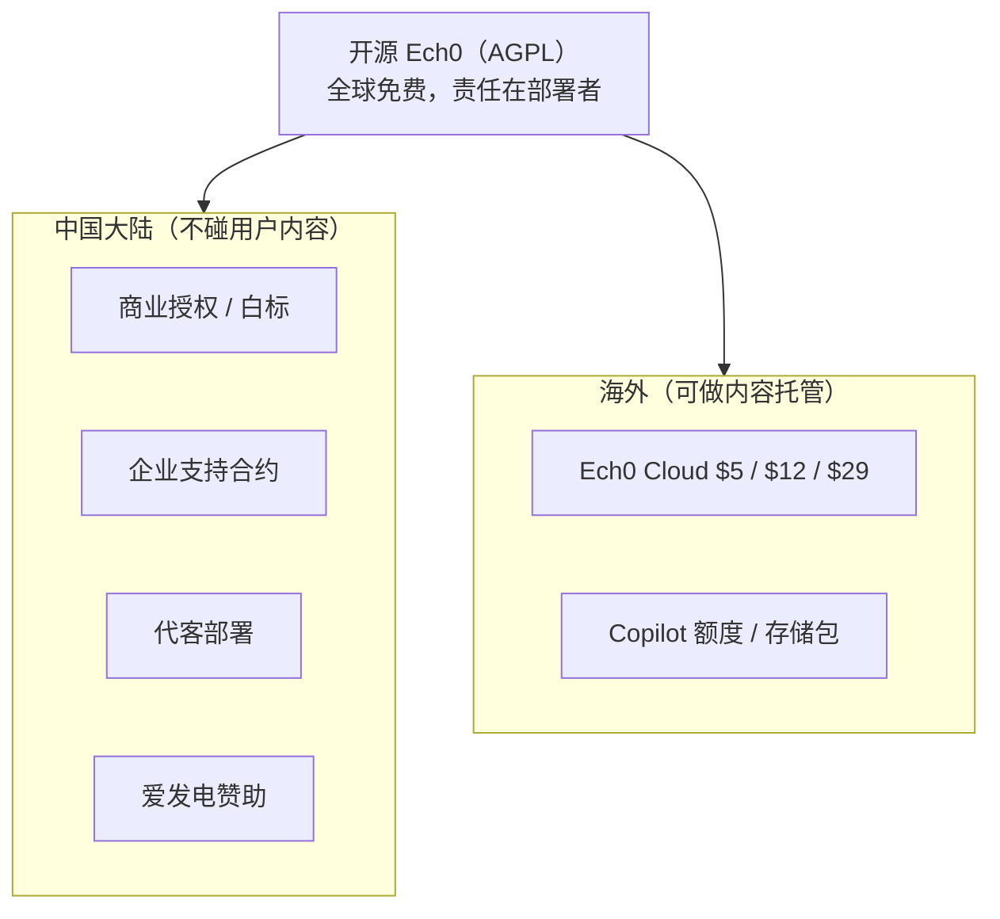

# 合规现实检验：托管 Ech0 到底要付出什么

> **同属假设推演**，是 [`commercialization-blueprint.md`](./commercialization-blueprint.md) 的配套文档。Ech0 当前不打算商业化。
>
> 本文不是法律意见。所有法规引用均标注了出处，但**法规会变、各地执行口径不同**，真要落地必须找执业律师和有资质的代办确认。文中成本为公开渠道的估算区间。
>
> 写作日期：2026-07。

---

## 0. 一句话结论

**合规不是商业化的一个待办事项，它是一个一票否决项 —— 而且它否决的正是蓝图里的主力产品。**

| 市场 | 官方托管 Ech0（UGC + 收费） | 判定 |
| --- | --- | --- |
| **中国大陆** | 需要：公司主体 + 100 万注册资本 + 经营性 ICP 许可证 + 安全评估 + 实名认证 + 内容审核机制 + 等保备案 | ❌ **一人团队结构性不可行**（首年合规成本 ≈ 收入的 100 倍） |
| **海外（美国主体）** | 需要：DMCA 指定代理（$6/3年）+ 隐私政策 + GDPR 欧盟代表（若面向欧盟） | ✅ 可行，年成本几千元人民币量级 |

**修正后的方案**：国内**不做**内容托管，只卖商业授权 / 白标 / 支持合约（不碰用户内容 = 不触发上述任何一条）；Cloud 只面向海外。详见 §6。

---

## 1. 为什么 Ech0 的合规风险高于一般 SaaS

一个卖 API、卖工具、卖表格的 SaaS，用户数据是私有的、不对外的。Ech0 不是。

| 产品特征 | 合规含义 |
| --- | --- |
| 用户发布**内容**（Echo） | 你成为 UGC 平台，不再是工具提供方 |
| 内容**默认公开可读** | 触发"面向公众提供信息服务"，而非私有存储 |
| 有**评论系统** | 第三方（非注册用户）也能产生内容，责任面更大 |
| 有 **RSS 输出** | 内容主动向外分发 |
| **Hub 聚合**多个实例 | 你在自己的域名下呈现他人内容 |
| 形态就是**微博客 / 博客** | 中国法规里被逐字点名（§3.3） |

**换句话说：托管 Ech0 = 运营一个微型社交媒体平台**，而不是"帮人跑一个容器"。监管看的是后果，不是你的自我定位。

---

## 2. 关键概念：责任转移

这是整篇文档最重要的一张图。Ech0 现在之所以没有任何合规负担，不是因为它小，而是因为**它把责任留在了部署者手里**。



> **一句话**：`docker run` 的那一刻，法律责任跟着容器一起交到了用户手上。你一旦替他跑这个容器并收费，责任就跑回你身上。**商业化的本质是买下这份责任，而合规成本就是这份责任的标价。**

这也意味着一件正面的事：**"自托管 = 责任和数据都在你自己手里"是一个可以写进营销文案的真实优势**，而不只是技术偏好。

---

## 3. 中国大陆：逐项拆解

### 3.1 主体与 ICP 备案

| 项 | 结论 |
| --- | --- |
| 个人备案能否做 | **不能**。个人性质备案不得从事论坛运营、不得涉及企业/经营内容，网站名称甚至不能出现"论坛/社区/交流"字样。UGC 互动类明确受限 |
| 论坛类前置审批 | 国务院已停止办理 BBS 前置审批，纯论坛形态实际上办不下来 |
| 结论 | 必须**企业主体**备案；产品定位要避开"论坛"表述 |

来源：[阿里云 ICP 备案场景说明](https://help.aliyun.com/zh/icp-filing/basic-icp-service/product-overview/faq-about-icp-filing-applications-in-different-scenarios)、[百度智能云备案限制说明](https://cloud.baidu.com/doc/BeiAn/s/4kipobx5r)

### 3.2 经营性 ICP 许可证（**第一个硬门槛**）

只要**向用户收费**提供在线信息服务，就属于"经营性互联网信息服务"，需取得经营性 ICP 许可证。这不只覆盖电商，也明确覆盖**会员订阅类网站、付费 API、付费内容服务**。

| 要求 | 数值 |
| --- | --- |
| 主体 | 公司（内资，外资另有限制） |
| 注册资本 | **不少于 100 万元人民币**，且需提供**验资报告或银行入资凭证** |
| 人员 | 通常要求若干名员工社保记录 |
| 周期 | 数月 |
| 代办费用 | 约 ¥1–3 万 |

来源：[湘应 · 经营性 ICP 办理条件](https://www.xiang-ying.cn/article/16225.html)、[中企百通 · ICP 与 EDI 区别](https://www.miibt.com/show-48-921-1.html)、[EDI 许可证办理条件](https://www.xiang-ying.cn/article/5294.html)

> **注**：Ech0 Cloud 不做交易撮合，大概率只需 ICP 证而非 EDI 证。但 100 万注册资本这条两者都要。

### 3.3 安全评估：**Ech0 被逐字点名**

《具有舆论属性或社会动员能力的互联网信息服务安全评估规定》的适用范围明确列举：

> 论坛、**博客**、**微博客**、聊天室、通讯群组、公众账号、短视频、网络直播、信息分享、小程序等信息服务**或者附设相应功能**

Ech0 的产品定位是"个人微博（timeline）"，评论系统即"附设相应功能"。**没有任何解释空间**。上线时需自行开展安全评估并按规定报送。

来源：[中央网信办 · 规定发布](https://www.cac.gov.cn/2019-03/20/c_1124259405.htm)、[规定全文（新华网）](http://www.xinhuanet.com/politics/2018-11/15/c_1123719346.htm)

### 3.4 实名认证：**与产品性格正面冲突**

《互联网用户账号信息管理规定》（网信办令第10号，2022-08-01 施行）要求：对申请注册的用户进行**基于移动电话号码、身份证件号码或统一社会信用代码**的真实身份信息认证，并建立账号信息核验、内容安全、生态治理、应急处置等管理制度，配备**与服务规模相适应的专业人员和技术能力**。

对 Ech0 意味着：
- 注册要接短信/实名通道（成本 + 开发 + 用户流失）；
- 评论者也是"用户"，匿名评论这个功能可能保不住；
- "配备与规模相适应的专业人员" —— 一个人如何证明"相适应"，是个开放问题。

来源：[中央网信办 · 规定原文](https://www.cac.gov.cn/2022-06/26/c_1657868775042841.htm)、[中国政府网](https://www.gov.cn/zhengce/zhengceku/2022-06/28/content_5698179.htm)

### 3.5 内容审核与连带责任（**真正的杀手**）

平台需建立内容审核机制；用户上传的违规内容通过平台传播的，**平台至少承担连带责任**，并需具备警示、限期改正、限制功能、暂停、关闭账号等处置能力。

对一人团队的实际含义：

- 你要为**素未谋面的陌生人**发布的每一条内容承担法律后果；
- 处置需要**及时**——实践中意味着接近 7×24 的响应能力；
- 这与蓝图 §9 里"工作日 24 小时内响应"的现实承诺**直接矛盾**；
- 外包内容审核服务可行，但按量计费，且在低收入规模下毫无经济性。

> **这一条单独就足以否决国内托管方案。** 前面的钱都还能想办法，这一条是拿**个人的法律风险**去换每月几千块毛利。

来源：[互联网用户账号信息管理规定](https://www.cac.gov.cn/2022-06/26/c_1657868775042841.htm)、[UGC 平台内容审核实务](https://zhuanlan.zhihu.com/p/708786180)

### 3.6 网络安全等级保护

二级及以上系统需定级备案。**备案本身公安机关不收费**；测评并非定级备案的必经程序，通常在公安机关认为需整改、或三级以上系统年度测评时才发生。二级测评市场价约 **¥6–8 万**（不含整改）。

来源：[等保定级备案实务问答](https://www.huiyelaw.com/news-1132.html)、[等保 2.0 费用说明](https://www.sohu.com/a/902082718_122436788)

### 3.7 个人信息保护（PIPL）

隐私政策、告知同意、最小必要、删除权、安全事件响应等。相对而言这是本节里最容易做的一项 —— 而且 Ech0 的架构有先天优势：**一租户一实例，"删除个人信息"就是删一个目录**（蓝图 §7.1）。

### 3.8 国内合规成本小计（估算）

| 项 | 一次性 | 年度 |
| --- | --- | --- |
| 公司注册 + 代理记账 | ¥3,000 | ¥5,000 |
| **注册资本实缴/验资** | **¥1,000,000（资金占用）** | — |
| 经营性 ICP 许可证（代办） | ¥10,000–30,000 | 年检人力 |
| 等保测评（若被要求） | ¥60,000–80,000 | 二级非强制年测 |
| 安全评估（自评估人力） | — | 人力 |
| 实名认证通道 | 开发 | 按量 |
| 内容审核（外包或自担） | — | ¥ 不确定，但≥ 全部毛利 |
| **合计现金支出（首年，不含注册资本）** | **≈ ¥8–12 万** | **≈ ¥1 万 +** |

**对照蓝图 §8：** 盈亏平衡点是 33–49 个付费实例，对应月毛利约 ¥600–900、年化不到 ¥1 万。

> **首年合规现金支出 ≈ 年毛利的 10 倍以上，还没算 100 万注册资本的资金占用和无法量化的内容责任风险。**
>
> 这不是"贵"，这是**商业模式在这个市场里不成立**。

---

## 4. 海外：完全不同的责任结构

同样是托管别人发的内容，美国的制度设计几乎是反过来的：

| 项 | 要求 | 成本 |
| --- | --- | --- |
| **DMCA 指定代理** | 允许用户存储/发布内容的服务商，需向美国版权局在线登记指定代理，并在网站公示；**每 3 年需重新登记**，过期即失去避风港 | **约 $6 / 3 年** |
| **Section 230** | 一般情况下，平台不对用户发布的内容承担发布者责任 | $0 |
| **隐私政策 / CCPA 等** | 需要，但模板化程度高 | 低 |
| **GDPR Art.27 欧盟代表** | 面向欧盟用户提供服务的非欧盟主体**基本都需要**指定代表，**无小企业豁免**（仅"偶发处理"等窄豁免） | 约 €200–800/年（代理服务） |
| **EU DSA** | 托管服务提供者有举报通道等义务，小微企业有部分减免 | **未核实，落地前需评估** |

来源：[美国版权局 DMCA 代理目录](https://www.copyright.gov/dmca-directory/)、[DMCA 避风港与代理指定](https://www.losey.law/dmca-safe-harbor-what-it-is-agent-designation/)、[国会研究局 DMCA 避风港概述](https://www.congress.gov/crs-product/IF11478)、[GDPR 第 27 条原文](https://gdpr-info.eu/art-27-gdpr/)、[小型初创是否需要 Art.27 代表](https://article27representative.eu/article-27/do-small-startups-need-an-article-27-gdpr-representative/)

**量级对比：**

```
国内托管首年合规现金支出：  ≈ ¥100,000+   （另占用 ¥1,000,000 注册资本）
海外托管首年合规现金支出：  ≈ ¥5,000      （DMCA $6 + GDPR 代表 + 政策文本）
                            ────────────────
                            相差约 20 倍现金 + 无限倍的个人责任风险
```

> $6 的 DMCA 登记费换来的责任豁免，在国内没有任何等价物。这不是政策好坏问题，是**同一个商业模式在两套制度下的可行性差了一个数量级**。

---

## 5. Hub 的合规暴露（以及它意外正确的架构）

`hub.ech0.app` 聚合他人实例的公开内容，在自己的域名下呈现 —— 听起来风险很大。但看它的实现（`hub/README.md`）：

> 「加载静态实例注册表 JSON，**在浏览器里并行请求各 Ech0 部署的 posts API**，合并成统一时间线」

**内容从不经过 Hub 的服务器。** Hub 是纯 CSR 的静态站（Cloudflare Workers Static Assets），服务器只发送了一个 JS 包和一份实例清单，所有内容拉取发生在访问者自己的浏览器里。

| 维度 | 影响 |
| --- | --- |
| 服务器是否存储/传输他人内容 | **否** |
| 是否构成内容分发 | 法律上存在讨论空间，但技术事实明显更弱 |
| 注册流程 | GitHub Issue → CI → PR → 人工合并，**全程公开可审计** |
| 部署地 | 境外（Cloudflare） |

> 当初为了"轻"而选的 CSR 架构，恰好也是**合规暴露最小**的架构。这不是运气，是同一种品味的两个结果：不持有不必要的东西，风险和成本会一起变小。
>
> 反过来说：**如果哪天为了 SEO 把 Hub 改成 SSR，就是在服务器上落地他人内容，性质会变。** 这个技术决策以后要连着合规一起评估。

---

## 6. 修正后的收入结构

蓝图 §4 原本的四条腿，按合规现实重排：

| 腿 | 原判断 | **合规修正后** |
| --- | --- | --- |
| **A. Cloud 托管** | 主力，占 70% | ⚠️ **仅限海外市场**。国内不做内容托管。国内用户可自愿使用海外 Cloud，但不主动在国内营销、不做国内支付 |
| **B. 增值资源包** | 20% | 随 A 走，同样仅海外 |
| **C. 商业授权 / 白标** | 8% | ⬆️ **升为国内市场的唯一主力**。卖的是软件授权与法律权利，**你不接触任何终端用户内容**，因此不触发 §3 的任何一条 |
| **D. 支持合约 / 赞助** | 2% | ⬆️ 国内第二腿。技术服务，同样不碰内容 |

**新增可行形态 E：代客部署（Managed Self-Hosting）**

这是绕开责任转移的巧妙变体，值得单列：

```
不在你的服务器上跑用户的 Ech0，而是在【客户自己的云账号】里跑。
你交付的是：部署、升级、备份配置、监控接入 —— 纯技术服务。
备案主体、内容责任、数据所有权，全部仍在客户手上。
```

| 对比 | 官方 Cloud | 代客部署 |
| --- | --- | --- |
| 谁是网络运营者 | 你 | 客户 |
| 内容责任 | 你 | 客户 |
| 需要经营性 ICP 证 | 是 | 否（技术服务） |
| 客单价 | ¥19–99/月 | ¥2,000–8,000/次 + 年维护 |
| 可规模化 | 是 | 否（人力密集） |

代客部署卖不出量，但**它能在国内合法地把"我帮你搞定运维"这件事变现**，而且客单价高。对一人团队来说，10 个代客部署客户 ≈ 100 个 Cloud 用户的收入，运维负担还更低。

**最终的国内 / 海外分工：**



---

## 7. 如果产品真要支持托管，工程上必须补什么

这些**不在**蓝图 §7.2 的"三个小口子"里，是纯粹被合规逼出来的额外投入 —— 也是判断"值不值得做托管"时容易漏算的部分：

| 能力 | 触发依据 | 是否污染开源核心 |
| --- | --- | --- |
| 举报 / 投诉入口 | UGC 平台通用义务、DSA | 可做成开源功能（自托管也用得上）✅ |
| 内容下架 + 处置审计日志 | 内容审核机制要求 | 同上 ✅ |
| 网络日志留存（**留存期需核实，一般理解为不少于 6 个月**） | 网络安全法 | 属托管侧，放控制面 ✅ |
| 实名认证接入 | 账号信息管理规定 | ❌ **只应存在于托管版**，塞进开源核心会激怒社区 |
| 数据导出 / 删除自助 | PIPL、GDPR 数据主体权利 | **已具备**（Snapshot）✅ |
| DMCA 通知处理流程 | 美国避风港 | 流程，非代码 |

> 注意最后一行的第二列：**Ech0 已有的快照能力，恰好覆盖了 GDPR/PIPL 里最麻烦的"数据可携带权"和"删除权"。** 当初为了让用户能迁走而做的功能，在合规语境下直接变成资产。再一次印证：把用户利益放在架构里，后面会以别的形式还回来。

---

## 8. 结论

1. **合规不是清单，是模式选择。** 它不会告诉你"要多填几张表"，它会告诉你"这条腿在这个市场上不能走"。
2. **国内：卖软件和服务，不卖托管。** 商业授权 + 支持合约 + 代客部署，全部不接触终端用户内容，因此绕开了 §3 的全部门槛。
3. **海外：可以做 Cloud。** DMCA 指定代理 + 隐私政策 + GDPR 代表，几千元/年，责任结构可承受。
4. **自托管形态本身是合规资产**，不只是技术偏好 —— 它把责任留在部署者手里，这是 Ech0 能以一人之力存在的根本原因。
5. **最讽刺的一点**：蓝图算出盈亏平衡只要 33 个付费用户，看起来门槛很低；合规一算，国内版的门槛是 100 万注册资本和一份没有上限的内容责任。**真正的创业门槛从来不在技术和用户数上。**

> Founder 的体验值在这里达到峰值：你会发现自己花了三天想清楚定价和增长飞轮，然后花两个小时读法规，把主力产品砍掉了一半。**这才是当 founder 最真实的部分。**

---

## 9. 待核实清单（真要做的话）

- [ ] 经营性 ICP 许可证：本省具体的社保人员数量、场地、系统评测要求
- [ ] 注册资本 100 万是否可认缴、验资时点要求
- [ ] 安全评估的具体报送流程与受理主体
- [ ] 等保定级：Ech0 Cloud 应定二级还是三级
- [ ] 网络日志留存期限的准确表述与实现要求
- [ ] EU DSA 对小微托管服务商的具体义务与减免
- [ ] 海外主体形态（美国 LLC / 新加坡 / 香港）与税务
- [ ] Stripe 对 UGC 平台的商户政策（部分内容类目受限）
- [ ] 商标注册（蓝图 §10.3）—— 与合规无关，但同样属于"晚做会后悔"的事

---

## 相关文档

- [`commercialization-blueprint.md`](./commercialization-blueprint.md) — 商业化闭环推演（本文修正其 §4 收入结构与 §10 法务节）
- [`docs/legal/agpl-compliance.md`](../legal/agpl-compliance.md) — AGPL 开源许可合规（与本文的**监管合规**是两件事，别混）
- [`COMMERCIAL.md`](../../COMMERCIAL.md) — 商业授权入口（修正后国内的主力通道）
- [`hub/README.md`](../../hub/README.md) — Hub 的 CSR 架构（§5 的依据）
