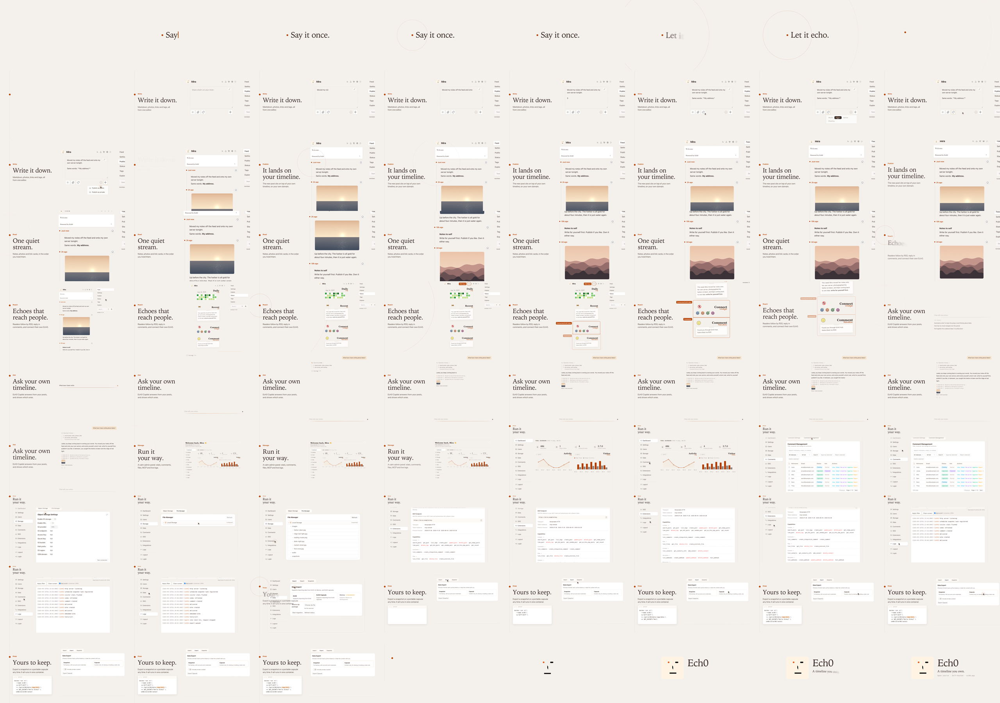

# Ech0 品牌宣传片

[`ech0-promo.mp4`](ech0-promo.mp4)：1920×1080 · 30fps · 80 秒 · 英文 · H.264 + AAC，响度约 -16 LUFS。

- **范围**：当前产品（v5.7.0）的整体介绍，用于营销，不是更新日志。
- **平台面**：Web 桌面端，包括公开站点和管理后台。TUI/CLI、移动端/PWA、外部 MCP 客户端的实际调用没有出现在片中。
- **风格**：沿用产品自己的设计（暖纸色、焦橙强调色、Iowan Old Style 展示字体），全程 light 主题。



## 故事线

主线是一颗橙点：它是时间线上每条 Echo 的日期圆点，也是 logo 的"眼睛"。一条想法写下、发布、被更多人看到、被 Copilot 回想起来，由你自己管理，最后仍然属于你。

| 时间 | 章节 | 画面 |
|---|---|---|
| 0–8.75s | Say it once. / Let it echo. | 橙点亮起，回声环扩散，橙点变成片中的时间线 |
| 8.75–17.5s | Write it down. | 真实编辑器：打字 → 选 #notes 标签 → Publish as public |
| 17.5–31.25s | It lands on your timeline. / One quiet stream. | 新 Echo 落在时间线顶部并荡出回声环，然后往下滑过照片、笔记、链接卡 |
| 31.25–38.75s | Echoes that reach people. | Status 页：回声环依次点亮 Connect、RSS、Comments |
| 38.75–48.75s | Ask your own timeline. | Copilot：检索 → 流式回答，附引用的 Echo |
| 48.75–66.25s | Run it your way. | 管理后台：仪表盘 → 评论审核 → 文件管理（展开 images/）→ MCP（真实的 29 个工具）→ 实时系统日志，全部是真实点击 |
| 66.25–75s | Yours to keep. | 数据管理页：导出，选中 Capsule 格式；旁边打出 README 里的 `docker run` 命令 |
| 75–80s | Ech0 | logo 由四个笔画拼成，接一句 "A timeline you own." |

完整的方向推导、画面规范和逐秒镜头表见 [`source/DIRECTION.md`](source/DIRECTION.md)，制作 brief 见 [`source/BRIEF.md`](source/BRIEF.md)。

## 目录

```
video/
├── ech0-promo.mp4        成片
├── preview/              联系表（1fps）和 13 张关键帧
└── source/               可复现工程
    ├── DIRECTION.md      方向、专属手法、画面规范、镜头表
    ├── BRIEF.md          范围与用户决定
    ├── plan.json         镜头时间、主张来源、动作与音效 cue（时间的唯一来源）
    ├── evidence/         功能证据、风格审计、文案审阅、组件复用清单、音频来源、混音与交付检查报告
    ├── src/              影片引擎（React + GSAP）、镜头、fixture、Vue 桥接层（src/vue/）
    ├── tools/            score.py（原创配乐）、make_photos.py（演示照片）、probe.mjs / panel-tour.mjs（调试）
    ├── public/demo/      生成的演示照片和头像
    └── assets/sfx/       动作音效
```

## 怎么做的

- **真实组件**：功能镜头里是 Ech0 真实的 Vue 组件。`build-bridge.mjs` 用 `web/` 自己的 Vite、`@vitejs/plugin-vue`、UnoCSS 和主题样式编译 `HomeView`、`ChatPage`、`PanelView` 等页面，通过 `window.Ech0Bridge` 挂进影片页面。打字、选标签、发布、点 Status、发送问题、切换后台页面和子标签、展开文件树、选导出格式，都是对真实 DOM 的点击和输入。`PanelView` 挂载时注入了 `viewDepthKey = 1`，这样它内部的 `RouterView` 直接渲染子页面。
- **数据**：接口由 `src/fixtures/api.js`（前台）和 `src/fixtures/panel.js`（后台）返回演示数据，人物 "Mira"、评论者和其他实例都是虚构的。Copilot 的回答是写好的脚本，按影片时间以真实的 SSE 帧推给 `TheChatBox`。系统日志的实时行由一个假 WebSocket 按影片时间推送，帧格式和后端一致。
- **MCP manifest 是真的**：`src/fixtures/mcp-manifest.json` 是用真实的 `Adapter.RegisterAll` 构造 Registry 后导出的，通过 `go test -overlay` 临时加一个测试文件完成，没有改动仓库。后端工具变了以后可以用同样的方法重新导出。
- **演示域名**：出片脚本用 `https://mira.example/` 打开页面，请求由 Playwright 拦截后转给本地服务（`server.mjs` 的 `openFilm`）。所以 MCP 页显示的 endpoint 是演示地址，而不是 `127.0.0.1`。
- **素材**：照片、头像、配乐都是代码原创生成。音效来自 [guizang product video skill](https://github.com/op7418/guizang-product-video-skill) 自带的原创 WAV。
- **许可**：影片引擎起步代码来自上述 skill，采用 AGPL-3.0（见 `source/LICENSE`、`source/NOTICE.md`）。

## 重新出片

需要 Node ≥ 22、FFmpeg、Python 3（带 numpy、scipy），以及安装好依赖的 `web/node_modules`。另外要有上述 skill，因为混音和交付检查脚本在里面。

```sh
cd docs/design/video/source
npm ci
npx playwright install chromium --only-shell   # 或者用 FILM_CHROMIUM=<chrome-headless-shell 路径> 指定本机已有的浏览器
python3 tools/score.py assets/music.wav        # 重新合成配乐
python3 <skill-dir>/scripts/mix_audio.py plan.json   # 生成 assets/master.wav 和 evidence/audio-mix.json
node build.mjs                                 # 先编译 Vue 桥接层，再构建影片页面
node stills.mjs evidence/stills 12 19.5 36.8   # 抽几张静帧看看
node render.mjs --audio assets/master.wav --output renders/ech0-promo.mp4
python3 <skill-dir>/scripts/check_delivery.py plan.json --video renders/ech0-promo.mp4 --mix-report evidence/audio-mix.json
```

注意：

- `plan.json` 的 `repo` 已经改成相对路径（`../../../..`），所以 `evidence/audio-mix.json` 里记录的 plan 哈希和它对不上。出片前要重新跑一次 `mix_audio.py`。
- 生成的 wav、`dist/`、`.build/`、`renders/` 都已经在 `source/.gitignore` 里忽略。
- 产品界面变了之后，镜头里的取景坐标（`src/shots/home-layer.jsx`、`panel.jsx`、`copilot.jsx` 里的 `frameAt`、`scale` 和遮罩变量 `--mt` / `--ml`）可能需要重新调。
- 部分状态（系统日志的实时行、Copilot 的流式回答）只保证从前往后顺序播放时正确；随意向回跳转后，截出来的单帧可能和成片不一致。

## 已知限制

- 音效对位、电平和响度只用数据检查过，没有人工试听验收。
- 流式输出时，`AnimatedMarkdown` 会把粗体或斜体后面的文字整段挤到下一行，流结束后才恢复。所以片中 Copilot 的回答特意用了不带强调格式的纯文本。
