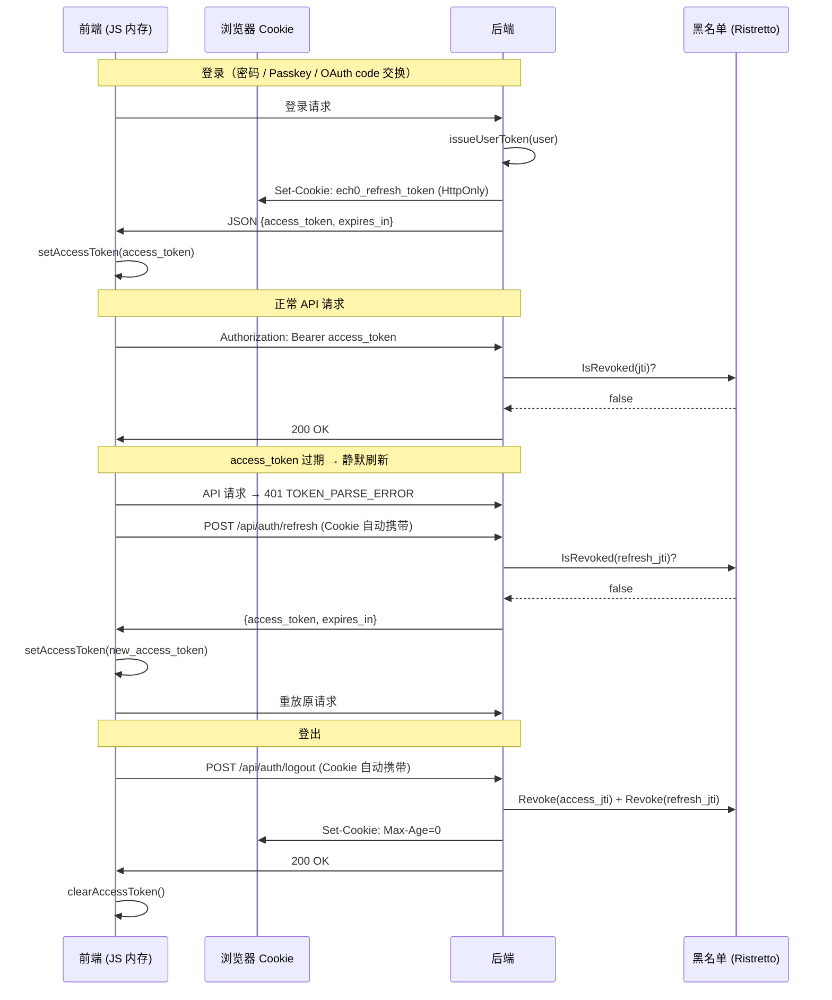

# 认证与身份系统设计文档

> 本文档描述 Ech0 的认证（Authentication）体系，包含双 Token 机制、OAuth/Passkey 登录、吊销策略以及前后端协作方式。

## 1. 架构总览

Ech0 采用 **Access Token + Refresh Token** 双令牌机制，遵循 OWASP 推荐的最佳实践：

| Token 类型 | 存储位置 | 有效期 | 用途 |
|---|---|---|---|
| Access Token (`typ: session`) | 前端 JS 内存变量 | 15 分钟（可配置） | 每次 API 请求携带（Authorization header） |
| Refresh Token (`typ: refresh`) | HttpOnly Cookie | 7 天（可配置） | 静默刷新、恢复会话 |
| API Access Token (`typ: access`) | 数据库（管理面板签发） | 自定义 | 面向 CLI / 集成 / MCP 的长期 token |

### 1.1 为什么这样设计

- **Access Token 存内存**：页面刷新后丢失，XSS 无法窃取持久凭证
- **Refresh Token 存 HttpOnly Cookie**：JS 无法读取 `document.cookie`，即使 XSS 也拿不到
- **Cookie Path 限制为 `/api/auth`**：仅在 refresh/logout/exchange 请求时携带，不污染其他 API 请求
- **SameSite=Lax**：阻止 CSRF POST，同时兼容 OAuth 重定向链路（Strict 会阻断 IdP → 回调的顶级导航）

## 2. Token 类型与 JWT Claims

所有 token 使用 HS256 签名，密钥为 `JWT_SECRET` 环境变量。

### 2.1 JWT Claims 结构

```go
// internal/model/auth/auth.go
type MyClaims struct {
    Userid   string   `json:"user_id"`
    Username string   `json:"username"`
    Type     string   `json:"typ"`       // "session" | "access" | "refresh"
    Scopes   []string `json:"scope,omitempty"`
    jwt.RegisteredClaims                  // iss, sub, aud, exp, iat, nbf, jti
}
```

### 2.2 三种 Token 类型

| 常量 | `typ` 值 | 签发函数 | 使用场景 |
|---|---|---|---|
| `TokenTypeSession` | `"session"` | `CreateClaims()` | 用户浏览器会话的 access token |
| `TokenTypeAccess` | `"access"` | `CreateAccessClaimsWithExpiry()` | 管理面板创建的 API token |
| `TokenTypeRefresh` | `"refresh"` | `CreateRefreshClaims()` | 静默刷新专用 |

> `ParseToken()` 仅接受 `session` / `access`，`ParseRefreshToken()` 仅接受 `refresh`，两者互不接受对方类型，防止 token 混用。

### 2.3 TokenPair 结构

```go
// internal/model/auth/auth.go
type TokenPair struct {
    AccessToken  string `json:"access_token"`
    RefreshToken string `json:"-"`         // 不序列化到 JSON，通过 Cookie 传递
    ExpiresIn    int    `json:"expires_in"` // access token 有效期（秒）
}
```

`RefreshToken` 字段标记为 `json:"-"`，确保它**永远不会出现在 HTTP 响应 body 中**，仅通过 `Set-Cookie` 传递。

## 3. 登录流程

Ech0 支持三种登录方式，它们最终都汇聚到同一个函数：

```
密码登录 ──→ AuthService.Login()              ──→ issueUserToken(user)
Passkey  ──→ AuthService.PasskeyLoginFinish()  ──→ issueUserToken(user)
OAuth    ──→ AuthService.HandleOAuthCallback() ──→ issueUserToken(user)
```

### 3.1 密码登录

```
前端                              后端
 │                                 │
 │  POST /api/login                │
 │  {username, password}           │
 │ ──────────────────────────────→ │
 │                                 │  验证密码
 │                                 │  issueUserToken(user)
 │                                 │    ├─ CreateClaims()     → access_token (15min, 带 JTI)
 │                                 │    └─ CreateRefreshClaims() → refresh_token (7天, 带 JTI)
 │                                 │
 │  Set-Cookie: ech0_refresh_token │  ← Handler 写入 HttpOnly Cookie
 │  JSON: {access_token, expires_in}│
 │ ←────────────────────────────── │
 │                                 │
 │  保存 access_token 到 JS 内存   │
```

### 3.2 OAuth 登录（一次性 code 交换）

OAuth 回调不能直接在 URL 中传递 JWT（太长 + 安全风险），改为一次性 code 交换：

```
第三方 IdP          后端                             前端
    │                │                                │
    │  callback      │                                │
    │ ─────────────→ │                                │
    │                │  换取用户信息                    │
    │                │  issueUserToken(user)           │
    │                │  生成 32 位随机 code             │
    │                │  缓存 {code → TokenPair} TTL=60s│
    │                │                                │
    │                │  302 → /auth?code=abc123        │
    │                │ ──────────────────────────────→ │
    │                │                                │  检测 URL ?code=
    │                │  POST /api/auth/exchange        │
    │                │  {code: "abc123"}               │
    │                │ ←────────────────────────────── │
    │                │                                │
    │                │  取出缓存并删除（一次性）         │
    │                │  Set-Cookie + JSON access_token │
    │                │ ──────────────────────────────→ │
```

相关代码链路：
- `HandleOAuthCallback()` → 生成 code 并存入 `oauthCodeCache`
- `ExchangeOAuthCode()` → 取出并删除缓存中的 TokenPair
- `AuthHandler.Exchange()` → 写 Cookie + 返回 access_token

### 3.3 Passkey 登录

Passkey 是 API 直接返回 JSON（不走 URL 重定向），所以不需要 code 交换：

```
前端                              后端
 │                                 │
 │  POST /api/passkey/login/begin  │
 │ ──────────────────────────────→ │  生成 WebAuthn challenge
 │  {nonce, publicKey}             │  将 session 存入缓存
 │ ←────────────────────────────── │
 │                                 │
 │  navigator.credentials.get()    │
 │  POST /api/passkey/login/finish │
 │  {nonce, credential}            │
 │ ──────────────────────────────→ │  验证签名
 │                                 │  issueUserToken(user)
 │  Set-Cookie + {access_token}    │
 │ ←────────────────────────────── │
```

## 4. 静默刷新（Token Refresh）

当 access token 过期或页面刷新后丢失时，前端自动通过 refresh token 恢复会话。

### 4.1 触发时机

1. **页面加载**：`userStore.autoLogin()` → `silentRefresh()`
2. **API 请求返回 401**：请求拦截器检测到 token 错误码 → `tryRefresh()` → 重放原请求

### 4.2 并发锁

多个请求可能同时触发刷新，使用 Promise 锁确保只发一次：

```typescript
// web/src/service/request/index.ts
let refreshPromise: Promise<boolean> | null = null

async function tryRefresh(): Promise<boolean> {
  if (refreshPromise) return refreshPromise  // 复用进行中的刷新
  refreshPromise = (async () => {
    // POST /api/auth/refresh (Cookie 自动携带)
    // 成功则 setAccessToken()，失败则 clearAccessToken()
  })()
  return refreshPromise
}
```

### 4.3 后端 Refresh 端点

```
POST /api/auth/refresh  （公开路由，不需要 Authorization header）
├─ 从 HttpOnly Cookie 读取 refresh_token
├─ ParseRefreshToken() 验证签名 + 过期时间
├─ IsTokenRevoked() 检查是否被吊销
├─ GetUserByID() 确认用户仍然存在
├─ CreateClaims() + GenerateToken() 签发新 access_token
└─ 返回 JSON {access_token, expires_in}
```

## 5. 吊销机制（Token Blacklist）

### 5.1 内存黑名单

黑名单由 `AuthRepository` 通过 Ristretto 内存缓存实现，接口定义在 `internal/service/auth/ports.go`：

```go
// internal/service/auth/ports.go
type TokenRevoker interface {
    RevokeToken(jti string, remainTTL time.Duration)
    IsTokenRevoked(jti string) bool
}
```

```go
// internal/repository/auth/auth.go — AuthRepository 实现 TokenRevoker
// 缓存键格式：token_blacklist:{jti}，TTL = token 剩余有效期
```

- `RevokeToken(jti, remainTTL)` — 将 JTI 存入缓存，TTL = token 剩余有效期
- `IsTokenRevoked(jti)` — O(1) 查找
- Token 过期后黑名单条目自动淘汰，无需手动清理

### 5.2 登出流程

```
POST /api/auth/logout
├─ 从 Cookie 读取 refresh_token → 将其 JTI 加入黑名单
├─ 从 Authorization header 读取 access_token（可选）→ 将其 JTI 加入黑名单
├─ 清除 Cookie（Max-Age=-1）
└─ 返回 200 OK
```

### 5.3 中间件检查

每个经过 `JWTAuthMiddleware` 的请求：

```
解析 JWT → 检查 JTI 是否在黑名单 → 通过则写入 viewer context
                ↓ 是
         返回 401 TOKEN_REVOKED
```

### 5.4 权衡

- **优势**：O(1) 查找、零外部依赖、自动 TTL 清理
- **局限**：服务重启后黑名单丢失，但 access token 只有 15 分钟有效期，最坏情况下被吊销的 token 还能用 15 分钟

## 6. Cookie 安全配置

```
Set-Cookie: ech0_refresh_token=<jwt>;
            HttpOnly;        ← JS 不可读（核心防线，防 XSS）
            SameSite=Lax;    ← 阻止 CSRF POST，兼容 OAuth 重定向
            Path=/api/auth;  ← 仅在 refresh/logout/exchange 时携带
            Max-Age=604800   ← 7 天
```

> **Secure 标志说明**：根据请求来源自动判断——当检测到 HTTPS（TLS 直连 / `X-Forwarded-Proto: https` /
> Origin / Referer 为 `https://`）时自动开启 `Secure`，否则关闭。自托管场景下若反代（Nginx/Caddy）
> 做 TLS 终止并转发 `X-Forwarded-Proto` 头，Cookie 会自动标记为 `Secure`；纯 HTTP 内网部署则不设置，
> 确保 Cookie 可正常送达。`HttpOnly` + `SameSite=Lax` + `Path` + 自适应 `Secure` 覆盖核心安全面
>（防 XSS + 防 CSRF + 最小暴露 + HTTPS 防窃听），零配置即可工作。

## 7. 配置项

| 环境变量 | 默认值 | 说明 |
|---|---|---|
| `ECH0_JWT_EXPIRES` | `900` (15min) | Access token 有效期（秒） |
| `ECH0_JWT_REFRESH_EXPIRES` | `604800` (7天) | Refresh token 有效期（秒） |
| `ECH0_JWT_ISSUER` | `ech0` | JWT 签发者 |
| `ECH0_JWT_AUDIENCE` | `ech0` | JWT 受众 |
| `JWT_SECRET` | 随机生成 | JWT 签名密钥 |
| `ECH0_AUTH_REDIRECT_ALLOWED_RETURN_URLS` | 空 | OAuth 回调后允许的前端重定向 URL 白名单（逗号分隔） |
| `ECH0_AUTH_WEBAUTHN_RP_ID` | 空 | WebAuthn Relying Party ID（通常为域名，如 `example.com`） |
| `ECH0_AUTH_WEBAUTHN_ORIGINS` | 空 | WebAuthn 允许的 Origins（逗号分隔，如 `https://example.com`） |

## 8. API Access Token（管理面板签发）

这是独立于浏览器会话的长期 token，面向 CLI / 集成 / MCP 使用：

- `typ: access`（区别于浏览器会话的 `typ: session`）
- 不走 Cookie，走 `Authorization: Bearer` header
- 有独立的 scope（`echo:read`, `admin:settings` 等）和 audience（`cli`, `integration`, `mcp-remote`）
- 详见 [access-token-scope-design.md](./access-token-scope-design.md)

## 9. 文件索引

### 后端

| 文件 | 职责 |
|---|---|
| `internal/model/auth/scope.go` | Token 类型常量、Scope/Audience 定义与校验 |
| `internal/model/auth/auth.go` | MyClaims、TokenPair、OAuth/Passkey DTO、Passkey GORM 实体 |
| `internal/model/auth/auth_dto.go` | LoginDto、RegisterDto |
| `internal/util/jwt/jwt.go` | JWT 签发与解析（CreateClaims / CreateRefreshClaims / ParseToken / ParseRefreshToken / GenerateOAuthState / ParseOAuthState / ParseAndVerifyIDToken） |
| `internal/util/cookie/cookie.go` | HttpOnly Cookie 读写工具 |
| `internal/repository/auth/auth.go` | 基于 Ristretto 的 JTI 黑名单、OAuth code 缓存、用户/身份查询、Passkey CRUD、挑战缓存 |
| `internal/service/auth/ports.go` | Service / Repository / AuthRepo / TokenRevoker 等接口定义 |
| `internal/service/auth/auth.go` | issueUserToken / Login / PasskeyLoginFinish / HandleOAuthCallback / ExchangeOAuthCode / OAuth 绑定与用户信息获取 |
| `internal/service/auth/oauth_adapter.go` | 按 provider 解析外部身份 |
| `internal/service/auth/provider.go` | Wire DI 绑定（AuthService → Service 接口） |
| `internal/handler/auth/auth.go` | /api/auth/refresh, /api/auth/logout, /api/auth/exchange |
| `internal/handler/auth/login.go` | 密码登录 handler（写 Cookie + 返回 access_token） |
| `internal/handler/auth/oauth.go` | OAuth 统一路由（/oauth/:provider/login、/callback、/bind、/info） |
| `internal/handler/auth/passkey.go` | Passkey 注册/登录/列表/删除/改名 handler |
| `internal/router/auth.go` | 认证相关路由注册（公开 + 需鉴权） |
| `internal/middleware/auth.go` | JWT 鉴权中间件（含黑名单检查 + 匿名降级） |
| `internal/middleware/scope.go` | Scope / Audience 权限检查 |
| `internal/repository/provider.go` | Wire 聚合：AuthRepository → AuthRepo / TokenRevoker / Repository 接口绑定 |

### 前端

| 文件 | 职责 |
|---|---|
| `web/src/stores/auth.ts` | Pinia 认证状态管理；access_token 内存存取 |
| `web/src/service/request/shared.ts` | 请求相关共享工具（URL helpers、初始化状态） |
| `web/src/service/request/index.ts` | 请求封装、401 拦截 + 静默刷新（tryRefresh / silentRefresh） |
| `web/src/service/api/auth.ts` | 登录 / 登出 / code 交换 / Passkey API |
| `web/src/stores/user.ts` | 用户信息状态管理 |
| `web/src/views/auth/modules/AuthPage.vue` | 登录页（密码 / OAuth code 检测 / Passkey） |

## 10. 认证流程时序图


