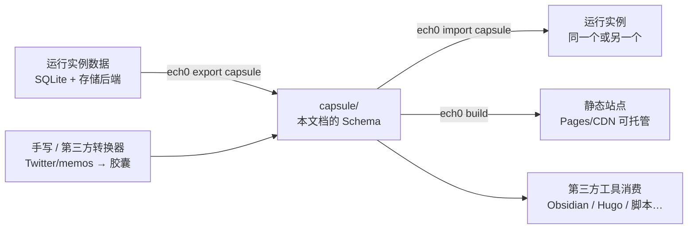

# Ech0 Capsule（内容胶囊）Schema 与静态站构建（设计草案）

> **状态：草案，讨论中。** 本文是设计讨论的工作文档，尚未定稿，任何小节都可能被推翻。
> 开放问题集中在 [§9](#9-开放问题讨论议程)，按编号引用讨论。

---

## 1. 一句话概括

为 Ech0 增加一套**版本化、人类可读、自包含**的内容交换格式——**Capsule（胶囊）**（frontmatter-markdown + YAML + 媒体目录），并提供一组 CLI 命令（语法详见 §5）：

- `ech0 export capsule|snapshot`：从运行实例导出胶囊 / zip 快照；
- `ech0 import capsule|snapshot`：内容级增量灌入 / 字节级整库替换；
- `ech0 check`：校验胶囊是否符合 schema（`--fix` 回写可自动修复项，如缺失的 `id`）；仅作用于胶囊；
- `ech0 build`：从胶囊编译出可静态部署的只读站点（复用现有 `web/` SPA）；仅作用于胶囊。

产品形态不变：Ech0 仍是常驻服务端 + SPA 的微博客。胶囊、导入与静态构建是**纯增量能力**。

## 2. 目标与非目标

### 2.1 目标（按优先级）

1. **数据长期主义**：数据比软件活得久。胶囊可读、可 diff、可被第三方工具（Obsidian、Hugo、自写脚本）直接消费，即使 Ech0 项目停止维护，内容也不锁死。
2. **内容级往返**：`export` → `import` 闭环。换机、跨实例迁移、跨存储后端迁移（本地导出 → S3 实例导入）都走胶囊，不再需要手工操作数据库。
3. **体面的退场路径**：不想继续运维实例时，一条命令把全部内容变成可托管在 GitHub Pages / CDN 上的永久存档。
4. **灾备与归档部署**：server 写、静态读的镜像模式（主站挂了静态站还在）。
5. **中立交换格式 /「微博客编译器」**：`ech0 build` / `ech0 import` 只认 schema 不认来源——手写胶囊、第三方转换器（如 Twitter/memos 导出 → 胶囊）产出的合规胶囊同样能编译成静态站或灌入实例，无需运行过 Ech0。

### 2.2 非目标（v1 明确不做）

- ❌ **CLI-first 写作流**：不改变「随手快发」的微博客产品形态。胶囊**可以**手写（受支持的输入，见目标 5），但 v1 **不优化手写工作流**——不做 `ech0 new` 脚手架、不做 watch 模式、不做本地预览服务器。server 仍是旗舰写作体验。
- ❌ **flat-file 存储引擎**：SQLite 仍是运行时唯一 source of truth，不做「文件即数据库」的架构反转（会重写整个 repository 层，且与产品形态冲突，已否决，见 §10）。
- ❌ **字节级灾备**：胶囊承诺**内容等价**而非字节等价（见 §4.8）。凭据、运维配置、访客统计不经胶囊往返；完整灾备仍由 Migrator 域的 zip 快照负责。
- ❌ **主题系统 / 增量构建 / 部署集成**：静态站输出就是现有 Ech0 外观，一条命令一种输出。
- ❌ **第二套前端**：不为静态站单独维护一套 UI（双倍前端维护成本，已否决，见 §10）。

## 3. 总体架构



关键设计约束：**胶囊是命令之间的唯一接口**。`ech0 build` / `ech0 import` 只读胶囊、只认 schema 不认来源，手写或第三方生成的合规胶囊一律可用（经 §4.7 严格校验）。这同时保证 schema 有第一方消费者天天使用，不会随版本漂移腐烂。

## 4. Capsule Schema v1

### 4.1 目录布局

```text
capsule/
  ech0.yaml                 # 清单：schema 版本、站点信息、导出元数据、connects
  echoes/
    2026/
      2026-08-01-0198a3f2.md   # 每条 Echo 一个 frontmatter-markdown 文件
      …
  comments.yaml             # 评论快照（PublicComment 投影）
  files/                    # 媒体根目录，内部结构 mirror DataRoot（默认 data/files）
    images/                 #   即 internal/storage/schema.go 的 Resolve 目录约定
    audios/
    videos/
    documents/
    files/                  #   DefaultRoute("files/") 兜底类别（.zip/.txt 等）
```

设计要点：

- **每条 Echo 一个文件**，而不是一个大 YAML。理由：可 diff、可单独编辑、frontmatter-markdown 是 Hugo/Astro/Obsidian 通吃的生态标准，`Echo.Content` 本来就是 markdown。
- **files/ 内部结构原样 mirror `DataRoot`（默认 `data/files`）**：胶囊内相对路径 = `files/ + schema.Resolve(key)`，与本地磁盘布局逐一对应（`files/files/` 即 `DefaultRoute` 兜底类别的 mirror，属预期布局）。导出按 `files` 表**记录驱动**落位（非盲目目录拷贝，`data/files/snapshots/` 等非托管产物不进胶囊）；对本地实例，效果上仍近似一次目录拷贝。
- **胶囊自包含（托管文件）**：本地与对象存储（S3）的托管文件在导出时**字节入胶囊**，胶囊内一律相对路径、不依赖 `File.url`（URL 是运行时表示：`File.AfterFind` 会按当前配置重算，胶囊作为离线交换格式不该携带它）。**例外——外链文件（`storage_type=external`）**：字节不在 Ech0 存储里，`url` 即其权威表示，导出时原样透传、不下载本地化（版权与预期问题）。

### 4.2 清单文件 `ech0.yaml`

```yaml
schema_version: 1            # 整数，破坏性变更时递增
generator: ech0 v2.x.x       # 导出方版本，便于排查
exported_at: 2026-08-02T10:00:00Z

site:                        # 站点设置的公开子集（供静态站渲染与导入恢复）
  site_title: L1nSn0w 的小站            # 键名 = SystemSetting json tag 原样，import 整块反序列化零映射
  server_name: Ech0
  server_logo: /api/files/images/logo.png  # ServerLogo 原样字符串，不本地化改写（含实例 URL 时 check 警告）
  # 完整 site.* 字段清单见 spec.md §3（原 Q7：「渲染所需皆入，运维行为皆弃」，仅踢除 allow_register）

owner:
  username: l1nsn0w
  # 不含任何凭据。密码哈希 / token / OAuth 绑定 / Passkey 一律不入胶囊。

connects:                    # 互联实例列表快照
  - url: https://example.com
```

### 4.3 Echo 文件格式

文件名：`echoes/<年>/<YYYY-MM-DD>-<UUID 末 8 位>.md`（末 8 位落在 UUIDv7 的随机段；前 48 位是时间戳，同批创建的条目前缀重合到没有辨识度）。

```markdown
---
id: 0198a3f2-ac96-774b-bcce-b302099a8057
created_at: 2026-08-01T21:30:00Z           # RFC3339；DB 中为 Unix 秒，导出统一 UTC（原 Q6 已裁决）
username: l1nsn0w                          # 多用户实例区分作者
tags: [生活, 摄影]
layout: grid                               # waterfall|grid|horizontal|carousel|stack|none
private: false
fav_count: 12
files:
  - key: a1b2c3d4_1735689600_deadbeef.png  # File.Key 原样；字节位于 files/ + Resolve(key)
    category: image                        # File.Category 原样
extension:                                 # 可选；对应 EchoExtension
  type: WEBSITE                            # MUSIC|VIDEO|GITHUBPROJ|WEBSITE|LOCATION|TWEET
  payload:
    url: https://example.com
    title: ……
---

正文 markdown，与 `Echo.Content` 逐字一致。
```

映射规则：

| DB 字段（`internal/model/echo/echo.go`） | 胶囊位置 | 说明 |
|---|---|---|
| `Echo.ID` | frontmatter `id` | UUIDv7 原样保留，导入按此幂等 |
| `Echo.Content` | 正文 | 逐字，不做任何转换 |
| `Echo.CreatedAt` (int64) | `created_at` (RFC3339) | 人类可读优先，导入时转回 Unix 秒 |
| `Echo.Layout` / `Private` / `Username` / `FavCount` | 同名 frontmatter | `fav_count` 随往返保留 |
| `EchoFiles` → `files` 表 | `files[].key`（托管，`File.Key` 原样，字节位于 `files/ + Resolve(key)`）或 `files[].url`（外链透传）；`id/category/name/content_type/size/width/height` 可选原样携带 | 字段名与值对齐 `File` 列，import 1:1 入库零转换；**数组顺序即 `SortOrder`**；`storage_type`/`provider`/`bucket`/托管 `url` 不入胶囊（运行时拓扑，导入按目标配置重建）。权威定义见 `spec.md` §4.2 |
| `EchoExtension.Type/Payload` | `extension` | payload 原样 YAML 化 |
| `Tags` (many2many) | `tags` 名称数组 | Tag 的 `UsageCount` 导入后重新统计，不导出 |
| `Echo.UserID` | 不导出 | 内部外键，`username` 已足够，导入时重新映射（见 §5.3） |

### 4.4 评论快照 `comments.yaml`

复用现有 **`PublicComment` 投影**（`internal/model/comment/comment.go`）：已按约定剥离 `Email` / `IPHash` / `UserAgent` / `UserID`，只保留 nickname、website、content、status、两级楼层结构（`parent_id`）。胶囊中仅包含 `status == approved` 的评论。

```yaml
schema_version: 1
comments:
  - id: …
    echo_id: 0198a3f2-…
    parent_id: null
    nickname: 访客甲
    website: https://…
    content: ……
    created_at: 2026-08-01T22:00:00+08:00
```

隐私取舍的直接后果：**评论往返是有损的**（导入后 Email/IPHash 为空）。这是有意为之——胶囊会被公开分享、托管到 Pages，评论者邮箱绝不能跟着走。

**独立于 Echo 文件**（原 Q3 已裁决）：评论是第三方数据、变更生命周期与内容不同——混入 frontmatter 会污染内容文件的创作物身份、每来一条评论就给内容文件制造一次 diff 噪音、热门 Echo 的 frontmatter 会被数百行评论压垮。单文件而非按 Echo 分文件：微博客量级一个 YAML 可管理，且评论为机器产出快照、无手改合并冲突场景。

### 4.5 明确排除项

以下数据**不进入胶囊**（任何层都不含）：

- 认证凭据：密码哈希、access token、OAuth 绑定、Passkey 凭证；
- 运维配置：S3 密钥、Webhook 配置、Agent/LLM 设置、SMTP 设置；
- 可重建数据：embeddings 向量、Tag.UsageCount、访客统计、系统日志；
- 评论的隐私字段：Email、IPHash、UserAgent（由 PublicComment 投影保证）。

### 4.6 版本与兼容承诺

- `schema_version` 为整数。**追加字段不升版本**（消费者必须忽略未知字段）；字段语义变更或删除才升版本。
- 胶囊格式（目录布局、frontmatter 字段、`ech0.yaml`、`comments.yaml`）是**公开契约**，规范性定义见 [`spec.md`](./spec.md)（已起草，随本文档讨论同步演进）；定稿后 `spec.md` 即对外规格，本设计文档退役为背景资料。胶囊相关文档统一存放在 `docs/dev/capsule/`。

### 4.7 校验规则（`ech0 check`，import/build 前强制执行）

胶囊可能是手写的，良构不再是前提。校验错误报告精确到文件与字段（如 `echoes/2026/xxx.md: layout: gird 不是合法值，可选 waterfall|grid|…`）：

- `id`：**必填**且为合法 UUID。permalink（`/echo/:id`）稳定性与导入幂等都依赖它——缺失时拒绝，提示用 `ech0 check --fix` 生成 UUIDv7 并**回写进 frontmatter**（一次生成、永久稳定）。**不做**从路径/内容推断 id 的隐式魔法：路径一改深链全断，且推断规则会膨胀公开契约。
- `created_at`：必填，RFC3339 可解析。
- `layout` / `extension.type` / `files[].category`：必须为已定义枚举值。
- `files[].key`：禁止含 `/` 或 `..`；字节必须存在于 `files/ + Resolve(key)`。
- `comments.yaml` 的 `echo_id`：须能关联到已存在的 Echo（孤儿评论仅 warning）。
- 未知 frontmatter 字段：忽略并告警（与 §4.6 前向兼容承诺一致）。

### 4.8 往返保真度契约

胶囊承诺的是**内容等价**，不是字节等价：

| 数据 | 往返行为 |
|---|---|
| Echo（正文/标签/布局/扩展/私密标记/fav_count/创建时间/id） | ✅ 完整往返 |
| 媒体文件字节 | ✅ 完整往返（落地到目标实例**当前**存储后端） |
| 站点公开设置、connects | ✅ 往返（`ech0.yaml` 的 `site` 子集） |
| 评论 | ⚠️ 有损往返（Public 投影，无 Email/IPHash/UserID 关联） |
| 用户账号 / 凭据 / 运维配置 | ❌ 不往返（目标实例自行初始化，见 §4.5） |
| embeddings / 访客统计 / 日志 | ❌ 不往返（可重建或无保留价值） |

需要字节级恢复（含凭据与全部运行时状态）时，用 Migrator 域的 zip 快照，两者定位不同、长期并存。

## 5. CLI 命令

挂在现有 Cobra 入口（`cmd/ech0/main.go`）下，纯增量。

### 5.0 命令语法：动词在前，格式为子命令

`export` / `import` 同时覆盖两种可移植产物——**capsule**（本文档的内容交换格式）与 **snapshot**（Migrator 域既有的 zip 字节级快照）。格式作为**子命令**而非 `--type` flag，理由：

1. **flag 集合完全分叉**：`export capsule` 有 `--include-private/--zip`，`export snapshot` 只有 `-o`；`import capsule` 有 `--dry-run`，`import snapshot` 需要 `--yes`。子命令天然隔离各自的 flag 与 help，`--type` 则需要脆弱的条件校验。
2. **破坏性语义需要独立命令名**：`import snapshot` 是整库替换，`import capsule` 是幂等增量——一个 `--type` 值的笔误不该能把后者变成前者。

`check` / `build` 只作用于胶囊（snapshot 是不透明 zip，无 schema 可校验、无内容可编译），故无格式维度，直接吃位置参数。裸 `ech0 export` / `ech0 import` 不设默认格式，打印 help 列出两个子命令——备份语义下显式优于隐式。

### 5.1 `ech0 export capsule`

```bash
ech0 export capsule [-o ./capsule] [--include-private] [--zip]
```

- 读取运行实例数据（SQLite + 当前存储后端配置），写出 §4 胶囊。
- S3 文件按 `key + 当前存储配置` 拉取字节（与 `StreamFileByID` 同一读取路径语义，见 `internal/service/file/file.go`），保证自包含。
- `Private` Echo **默认排除**，`--include-private` 显式包含（原 Q2 已裁决，不做加密）。

### 5.2 `ech0 export snapshot`（P4，语法先行保留）

```bash
ech0 export snapshot [-o ./snapshot.zip]
```

- 现有 Migrator 域 zip 快照逻辑的 CLI 薄封装，补上服务器侧 cron 备份通道（目前只能 curl 带 token 调 web API）。

### 5.3 `ech0 check`

```bash
ech0 check [路径，默认 ./capsule] [--fix]
```

- 按 §4.7 校验胶囊，供手写/第三方生成的胶囊在 import/build 前自检。**仅作用于胶囊。**
- `--fix` 回写可自动修复项（目前仅：为缺失 `id` 的 Echo 生成 UUIDv7 并写回 frontmatter）。
- `ech0 import capsule` / `ech0 build` 隐式执行同一套校验，校验失败即终止。

### 5.4 `ech0 import capsule`

```bash
ech0 import capsule [路径，默认 ./capsule] [--dry-run] [--include-private]
```

内容级往返的落地端，语义如下：

- **幂等按 `id`**：目标库已存在同 `id` 的 Echo 时**跳过并报告**，不覆盖不合并，无 `--overwrite`。重复执行安全。（原 Q12 已裁决）
- **Echo**：frontmatter + 正文 → `Echo` 行；`created_at` 转回 Unix 秒；`fav_count` 原样恢复；Tag 按名称 find-or-create，`UsageCount` 重新统计。
- **媒体**：字节写入目标实例**当前配置的存储后端**（本地或 S3），生成新的 `files` 行与新的 `url` 快照。胶囊内相对路径只是交换表示，落地后回归运行时表示——跨存储后端迁移（本地 → S3）因此自然成立，不再需要 `docs/usage/storage-migration.md` 里的手工脚本流程。
- **原样导入**（原 Q12 已裁决）：胶囊字段值 1:1 入库，禁止数值转换——`username` 逐字保留不改写；唯一例外是补全内部必填外键 `Echo.UserID`（同名用户挂接，否则挂执行导入的 owner），展示归属始终以 `username` 为准。
- **评论**：按 Public 投影字段导入，`status` 保留，Email/IPHash 为空（§4.4 的有意取舍）。
- **站点设置**：`site` 子集仅在目标实例对应项为空时填充，不覆盖已有配置。
- **不发布事件**（原 Q13 已裁决）：导入不触发事件总线——webhook 回放历史内容是语义错误（消费者会理解为「刚刚发布」），embedding 增量索引本就「存量由回填命令兜底」（`internal/event/subscriber/embedding.go`），agent 处理器忽略事件载荷。导入报告末尾提醒可在后台触发索引重建。
- `--dry-run`：输出将创建/跳过的清单，不写库。

### 5.5 `ech0 import snapshot`（P4，语法先行保留）

```bash
ech0 import snapshot <snapshot.zip> --yes
```

- **字节级整库替换**（破坏性），对应现有 zip 快照恢复语义；`--yes` 为强制确认门，缺失即拒绝执行。
- 与 `import capsule` 的分工：zip 恢复 = 灾备回滚；胶囊导入 = 内容级增量灌入，二者并存、用途不同。

### 5.6 `ech0 build`

```bash
ech0 build [路径，默认 ./capsule] [-o ./dist] [--base-url /]
```

**仅作用于胶囊。** 纯 Go 实现，用户侧不需要 Node/pnpm：

1. 读胶囊，烘焙 `dataset.json`（echoes + tags + comments + site 元数据）；
2. 拷贝内嵌的 SPA 产物（`template/dist/`，与 serve 模式共用同一份 embed）；
3. 改写 `index.html` 注入 `window.__ECH0_STATIC__ = true` 标记；
4. 拷贝 `files/` → 输出目录 `api/files/`（与 serve 模式静态路由 `Engine.Static("api/files", DataRoot)` 同形，媒体 URL 无需改写，前端 `getFileUrl` 相对路径逻辑原样工作）；
5. 生成 `rss.xml`、`sitemap.xml`、`404.html`（SPA fallback）、`api/connect`（与活实例 `GET /api/connect` 响应体同形的冻结快照，原 Q10 已裁决产出，定义见 spec §10）。

## 6. 静态站：复用 `web/` SPA

### 6.1 可行性依据（已核实的代码事实）

- **单一请求咽喉**：所有 API 调用经 `web/src/service/request/index.ts` 的 `request<T>({url, method, data})`，API 层不直接碰 HTTP，返回统一信封 `App.Api.Response<T>`。静态模式只需一个同签名的替代实现。
- **`POST /echo/query` 不是障碍**：adapter 在 HTTP 之前拦截，分页/搜索/标签过滤/排序对烘焙数组在客户端执行（微博客量级为几 MB JSON）。
- **启动链路在咽喉之内**：路由守卫（`web/src/router/index.ts` `beforeEach`）依赖的 `initStore.init()` / `userStore.init()` 也走 `request()`；adapter 返回 `{initialized: true}` + 匿名用户即可，`requiresAuth` 路由（panel 等）自然不可达。

### 6.2 接线方式：单 bundle + 运行时开关

**不做第二份前端构建。** `main.ts` 启动时检查 `window.__ECH0_STATIC__`（由 `ech0 build` 注入），命中则动态 import 静态 adapter 替换 `request` 实现；正常模式下 adapter 代码不加载。前端产物不分叉，serve 与 build 共用同一份 `template/dist/` embed。

adapter 需要覆盖的只读端点（首页/详情/hub 所需）：

| 端点 | 静态数据源 |
|---|---|
| `POST /echo/query`、`GET /echo/:id`、`/echo/today`、`/echo/hot` | `dataset.json` 内存查询 |
| `GET /tags`、`/heatmap` | build 时预计算或客户端派生 |
| settings / status / user 只读端点 | `ech0.yaml` 烘焙的站点子集 + 匿名用户桩 |
| 评论只读端点 | `comments.yaml` 烘焙数据 |

### 6.3 交互降级矩阵

| 功能 | 静态站行为 |
|---|---|
| 点赞（`PUT /echo/like/:id`） | **冻结展示**（原 Q4 已裁决）：展示导出时的 `fav_count`，操作不可用 |
| 评论 | **冻结展示**（原 Q4 已裁决）：只读快照展示，发表入口隐藏 |
| 登录 / panel / init | 入口隐藏，路由不可达 |
| 搜索 / 标签过滤 / 分页 | 正常工作（客户端执行） |
| chat / agent / widget | 隐藏 |
| RSS / sitemap | build 时预生成静态文件 |
| 深链 `/echo/:id`（`createWebHistory`） | `404.html` SPA fallback（Pages 类托管标准做法） |
| SEO | v1 接受 CSR 的弱 SEO；预生成的 rss/sitemap 部分缓解。预渲染留作后续可选优化 |

## 7. 与现有系统的关系

- **服务端零侵入（v1 约束，已在 Web 集成时解除）**：v1 刻意不碰服务端——不改路由、不改 handler，胶囊只有 CLI 一条路。这条约束保证了胶囊能作为纯增量能力落地，但也把「导出内容/搬家」挡在了只会用面板的用户之外。Web 集成推翻了它：`POST /migration/export` 增加 `format`、`GET /migration/export/download` 增加 `?format=`、`source_type` 增加 `capsule`，DI 里多一个 `migrator.CapsuleEngine`。推翻的理由是这条约束保护的是**实现的整洁**，而拦住的是**用户的实际需要**；且集成代价很低——胶囊三个包的入口本就是不依赖作业框架的纯函数，接进既有 job.Manager 只是加了个分派分支。
  - 边界仍在：胶囊包**依旧**不过 service 层（直连 GORM）、**依旧**不发布事件（原 Q13）。Web 只是多了一个调用方，胶囊本身的语义一个字没改。
  - 产物落位是新增的正确性约束：胶囊产物独占 `data/files/capsules/`，因为它与快照都遵循「只保留最新一份」，共用目录会互删——尤其定时快照走 gocron 直连 ExportEngine、不过 job.Manager，作业互斥拦不住它。同理该目录**必须**进快照排除列表，否则每次快照都把上一个胶囊打进去、雪球式膨胀。两条不变量都在 `internal/migrator/artifact` 里收口。
- **Migrator zip 快照**继续作为字节级灾备（含 SQLite 原文件与全部运行时状态）；胶囊负责内容级交换与迁移（§4.8）。
- 新增 Extension 类型时，schema 映射表（§4.3）**必须同步更新**——这是发布公开契约后的持续纪律成本，需写进贡献指南。

## 8. 分期

| 阶段 | 交付 | 依赖 |
|---|---|---|
| P1 | 胶囊 schema 定稿 + `ech0 export` + `ech0 check` + 公开规格文档 | 本草案讨论收敛 |
| P2 | `ech0 import`（内容级往返闭环） | P1 |
| P3 | 静态 adapter + `ech0 build` + 降级矩阵落地 | P1（与 P2 互相独立，顺序可换） |
| P4 | 打磨：hub 页静态化、`--zip`、i18n 校验、文档 | P2 + P3 |

## 9. 开放问题（讨论议程）

**已全部裁决，议程清零。** Q1–Q15 完整裁决清单见 §10 决策记录：Q1（sidecar/保真度）、Q2（private 默认排除）、Q3（评论独立单文件）、Q4（冻结展示）、Q5（文件命名）、Q6（UTC）、Q7（site 子集）、Q8（与 zip 快照关系）、Q9（fav_count 位置）、Q10（产出 api/connect）、Q11（CLI 语法）、Q12（原样导入）、Q13（导入不发事件）、Q14（命名）、Q15（内嵌 URL 不改写+警告）。

## 10. 决策记录

已达成：

- **目标定位**：数据长期主义优先，静态站与导入是 schema 的第一方消费者（防 schema 腐烂），产品形态不变。
- **格式**：frontmatter-markdown 每 Echo 一文件，而非单一大 YAML。
- **命名**：格式名 **Capsule（胶囊）**（原 Q14，已终确认；候选 Bundle 因与 SPA bundle 项目内撞名、Artifact 因 CI 副产物语义反向而否决）；相关文档集中在 `docs/dev/capsule/`。
- **往返承诺 = 内容级**（原 Q1/Q8/Q9）：不做 sidecar，靠「忽略未知字段」留演进后门；`fav_count` 入可读层随往返保留；字节级恢复永久归 zip 快照，两者并存。
- **前端**：复用 `web/` SPA，单 bundle + 运行时开关 + 请求层 adapter；`ech0 build` 纯 Go。
- **隐私**：评论快照复用 `PublicComment` 投影，接受评论有损往返（胶囊会被公开分享，Email/IPHash 绝不入内）；凭据与运维配置永不入胶囊。
- **自包含**：托管媒体字节全部入胶囊，胶囊内只用相对路径，不携带运行时 URL；外链文件（`external`）例外，URL 原样透传；导入时按目标实例存储配置重建 `files` 行。
- **手写胶囊受支持**：`ech0 build` / `ech0 import` 只认 schema 不认来源；严格校验（§4.7）+ `ech0 check --fix` 回写 id；不优化手写工作流（无脚手架/watch/预览）。
- **CLI 语法 = 动词在前、格式为子命令**（原 Q11）：`ech0 export|import capsule|snapshot`，`check`/`build` 仅胶囊、吃位置参数；snapshot 子命令为 Migrator 既有逻辑的薄封装（P4，语法先行保留）。裸 `export`/`import` 无默认格式，打印 help。
- **评论独立单文件**（原 Q3）：`comments.yaml` 不混入 Echo frontmatter——第三方数据不污染创作物身份、评论追加不制造内容文件 diff 噪音；单文件而非按 Echo 分文件（微博客量级可管理，机器产出无手改冲突）。
- **时间导出统一 UTC**（原 Q6）：系统无「站点时区」概念（见 `docs/dev/timezone-design.md`，存储即 UTC、展示归浏览器），UTC 导出零新配置且逐字节确定；输入接受任意合法 RFC3339 偏移，语义为时刻。
- **`files[]` = `File` 列 1:1**（随「导出即转储」原则修订）：不设 `path` 字段——DB 无此列，位置由 `files/ + Resolve(key)` 纯函数派生；`key/category/name/content_type/size/width/height/id` 全部原样携带（可选）；幂等先按 `id` 复用、再按 key+内容哈希去重、撞名走 keygen 改名；export 取不回托管字节必须报错列清单（自包含是硬承诺）。
- **导入不发布事件、无逃生门**（原 Q13）：webhook 回放历史内容属语义错误而非仅噪音；embedding 走既有回填命令覆盖存量；`--emit-events` 作为「不该有人用的逃生门」被整体移除（纯契约面积）。
- **private 默认排除**（原 Q2）：export/import 双端默认排除 `private: true`，`--include-private` 显式包含；不做加密（胶囊定位可公开分享，私密内容要么不出门、要么显式带走）。
- **文件命名**（原 Q5，实现阶段修订）：`echoes/<年>/<YYYY-MM-DD>-<id 末 8 位>.md`；命名仅浏览友好，语义一律以 frontmatter 为准。原定「前 8 位」被真实数据推翻——UUIDv7 前 48 位是时间戳，实测 287 条里 270 条共用同一前缀，判别位必须取随机段。
- **site 子集**（原 Q7）：「渲染所需皆入，运维行为皆弃」——`SystemSetting` 十二字段仅踢 `allow_register`；键名 = json tag 原样（import 整块反序列化零映射）；`server_logo` 原样字符串不本地化；`custom_js`/`custom_css` 非空时 check 警告（第三方胶囊 = 执行对方代码）。
- **产出 `api/connect`**（原 Q10，推翻此前倾向）：与活实例响应体同形的冻结快照，远端探测路径零改动可消费；无扩展名文件的 Content-Type 局限记入 spec。
- **原样导入**（原 Q12）：胶囊形态尽量贴近 DB 形态，导入 1:1 入库禁止数值转换；`username` 逐字保留，仅补全内部必填外键 `UserID`（同名挂接，否则挂 owner）；无 `--overwrite`。
- **内嵌实例 URL 不改写**（原 Q15）：保「逐字一致」契约，`check` 警告级检测（`site.server_url` 前缀或 `/api/files/` 引用）；`--rewrite-content` 留作后续。
- **「导出即转储，构建即转换」**（总纲，Q12 原则的最终形态）：`export`/`import` 是 DB 的 1:1 序列化边界，字段名与值一律原样；一切消费导向的转换（URL 计算、dataset 烘焙、统计冻结）归 `build`。仅有的表示层差异为无损双射：时间 Unix 秒 ↔ RFC3339 UTC、行 ↔ frontmatter-markdown、关系实体以内容字段表示（Tags → 名称数组、SortOrder → 数组顺序）。
- **静态站互动痕迹 = 冻结展示**（原 Q4）：点赞数、评论快照按导出时状态只读展示，操作入口隐藏——互动痕迹是内容史的一部分，与 `api/connect` 冻结统计（Q10）逻辑自洽；隐藏会让存档站显得比原站「死」。

已否决：

- ❌ **Layer 3 架构反转**（文件即数据库、CLI-first）：重写 repository 层、与微博客快发形态冲突、等于换产品。
- ❌ **独立静态主题**（方案 B）：第二套 UI 的长期维护成本；SEO 收益不抵。
- ❌ **双前端构建产物**：运行时开关即可区分模式，产物分叉徒增发布复杂度。
- ❌ **Hugo 式宽松推断**（缺字段自动推断补全）：推断规则会成为永久公开契约，id 推断还破坏 permalink 稳定性；改用严格校验 + `--fix` 显式回写。
- ❌ **`--type=capsule|snapshot` flag 区分格式**：两种格式 flag 集合完全分叉需条件校验；破坏性（整库替换）与幂等（增量灌入）语义仅隔一个 flag 值，事故面不可接受。
- ❌ **字节级胶囊往返**：凭据/运维配置入胶囊与「可公开分享」定位根本冲突；字节级恢复已有 zip 快照承担。
