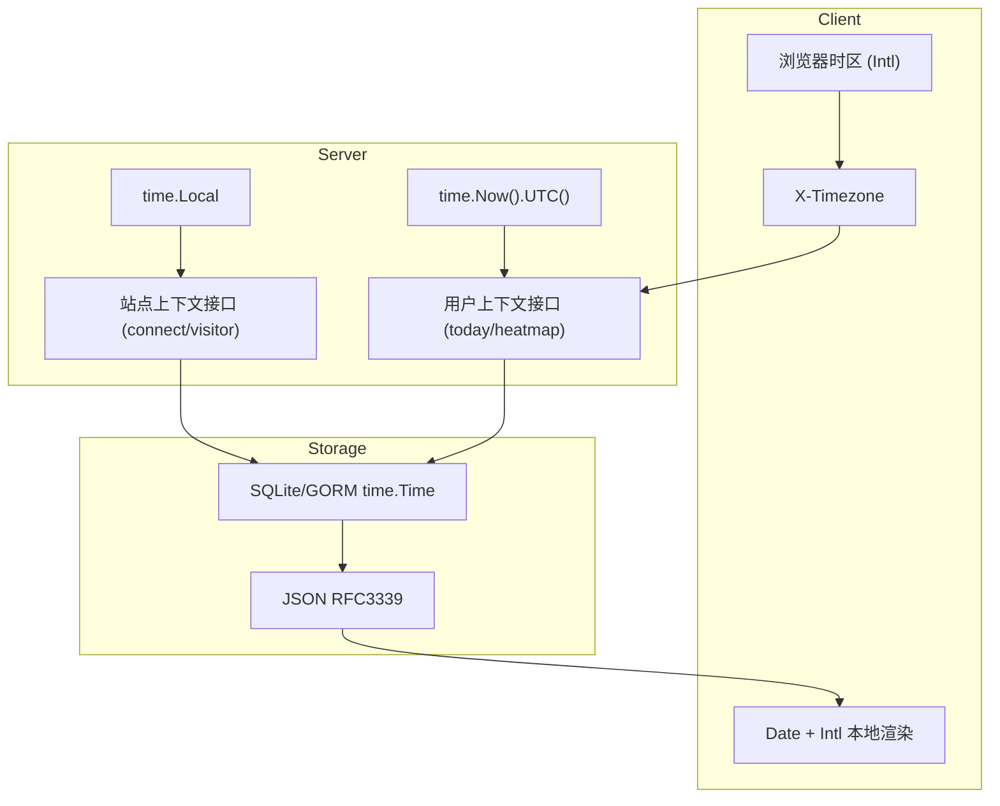

# Ech0 时间与时区设计说明

## 目标

- 保证不同时区用户看到“正确的本地时间”。
- 保证后端存储与计算语义一致，避免跨时区数据错位。
- 保持部署简单：优先复用运行环境时区（`time.Local` / `TZ`），不引入多套冲突配置。

## 核心原则

1. 存储层统一使用 UTC 语义（`time.Time` + RFC3339 序列化）。
2. 面向“用户日历日”的接口，使用客户端上报时区（`X-Timezone`）。
3. 无用户上下文的站点级统计，使用进程本地时区（`time.Local`，通常由 `TZ` 决定）。
4. 展示层交给浏览器本地时间能力（`Date` + `Intl.DateTimeFormat`）。

---

## 架构分层

---

## 分层设计细节

## 1) 存储层（Backend -> DB）

- 业务时间戳以 `time.Time` 保存，并在 JSON 中以 RFC3339 输出。
- 关键写入路径应优先使用 `time.Now().UTC()`，避免存储语义依赖机器本地时区。
- 对“按天”查询，先基于目标时区算日界，再转 UTC 进行数据库过滤。

典型场景：

- `today` 查询：目标用户时区的 `[00:00, 24:00)` 转 UTC 后查库。
- heatmap：查 UTC 区间后，再按目标时区映射到 `YYYY-MM-DD` 聚合。

## 2) API 层（Frontend -> Backend）

- 前端请求默认携带 `X-Timezone`（IANA 时区名，例如 `Asia/Shanghai`）。
- 后端通过 `NormalizeTimezone` / `LoadLocationOrUTC` 做校验与回退（非法值回退 `UTC`）。
- 该机制用于“用户视角时间语义”，如“今日内容”“热力图按天统计”。

## 3) 展示层（Frontend Render）

- 前端统一通过 `new Date(...)` 与 `Intl.DateTimeFormat(...)` 展示本地时间。
- 不在前端手写固定偏移（如 `+8`）逻辑，避免夏令时与跨地区问题。

## 4) 站点级时间语义（无用户上下文）

- `connect`、`visitor` 等无用户请求上下文的逻辑，使用 `time.Local`。
- `time.Local` 来源于运行环境（容器/系统）时区设置，通常由 `TZ` 决定。
- 若环境未配置可识别时区，按代码兜底回退 `UTC`。

---

## `tzdata`、`TZ`、`X-Timezone` 的职责边界

## `time/tzdata`（编译时内嵌）

- 作用：提供 IANA 时区数据库，确保程序可解析 `Asia/Shanghai`、`Europe/Berlin` 等时区名。
- 不决定“默认使用哪个时区”。

## `TZ`（部署时环境变量）

- 作用：决定进程本地时区（`time.Local`）。
- 影响无用户上下文的站点级逻辑。

## `X-Timezone`（请求头）

- 作用：传达“当前用户的时区”。
- 影响用户视角接口，不用于全站默认时区定义。

---

## 当前项目中的推荐实践

- 用户相关接口：
  - 使用 `X-Timezone`，按用户时区计算日界（today、heatmap）。
- 站点相关接口：
  - 使用 `time.Local`（由 `TZ`/系统时区决定）。
- 时间写入：
  - 默认使用 `time.Now().UTC()`。
- 时间展示：
  - 前端统一 `Date + Intl`。

---

## 常见错误与规避

- 错误：混用 `time.Now()` 与 `time.Now().UTC()` 写库。
  - 规避：持久化时间统一 UTC。
- 错误：按 SQL `DATE(created_at)` 直接切日。
  - 规避：先算目标时区日界再转 UTC 查询。
- 错误：前端手工写死时区偏移。
  - 规避：使用浏览器原生时区能力。
- 错误：把 `X-Timezone` 当作全站默认时区。
  - 规避：`X-Timezone` 只用于当前请求用户语义。

---

## 排障清单

当出现“今天数据不对”“热力图错天”时，按顺序检查：

1. 前端请求是否携带正确 `X-Timezone`。
2. 后端是否正确 `NormalizeTimezone`。
3. 查询是否使用“目标时区日界 -> UTC 区间”。
4. 部署环境 `TZ` 是否符合站点预期（影响 `time.Local` 语义）。
5. 返回 JSON 时间戳是否为 RFC3339 且可被浏览器正确解析。

---

## 测试建议（最小覆盖）

- 用例 A：`Asia/Shanghai` 用户跨 UTC 日界发布，检查 today/heatmap 是否归到本地正确日期。
- 用例 B：`America/Los_Angeles` 与 `Asia/Tokyo` 同时访问同数据，today 结果应按各自时区不同。
- 用例 C：非法 `X-Timezone`，应回退 `UTC` 且接口稳定返回。
- 用例 D：切换部署 `TZ`，验证 `connect` / `visitor` 的按天统计边界变化符合预期。

---

## 存储层表级审查结果（当前实现）

说明：

- 审查范围为 `internal/database/database.go` 中 `AutoMigrate` 注册的表。
- 结论口径：
  - “UTC 显式”：业务代码明确写入 `time.Now().UTC()` 或 UTC 派生时间。
  - “Local/GORM 自动”：依赖 GORM 自动时间戳（通常来自 `time.Now()`，受 `time.Local`/`TZ` 影响）。
  - “混合”：同一表的不同时间字段来源不同。

| 模型（表） | 时间字段 | 当前写入行为 | 结论 |
|---|---|---|---|
| `user.UserLocalAuth` (`user_local_auth`) | `updated_at` | `gorm:"autoUpdateTime"` 自动维护 | Local/GORM 自动 |
| `user.UserExternalIdentity` (`user_external_identities`) | `created_at`, `updated_at` | `autoCreateTime/autoUpdateTime` | Local/GORM 自动 |
| `user.WebAuthnCredential` (`webauthn_credentials`) | `created_at`, `updated_at`, `last_used_at` | `created_at/updated_at` 由 GORM 自动；`last_used_at` 在 Passkey 逻辑中以 `time.Now().UTC()` 写入 | 混合（字段级） |
| `echo.Echo` (`echos`) | `created_at` | 创建时未显式赋值，依赖 GORM 自动时间 | Local/GORM 自动 |
| `echo.EchoExtension` (`echo_extensions`) | `created_at`, `updated_at` | 未显式统一 UTC，依赖 GORM/更新路径 | Local/GORM 自动 |
| `echo.Tag` (`tags`) | `created_at` | 创建时未显式赋值，依赖 GORM 自动时间 | Local/GORM 自动 |
| `file.File` (`files`) | `created_at` | 创建时未显式赋值，依赖 GORM 自动时间 | Local/GORM 自动 |
| `file.TempFile` (`temp_files`) | `expire_at`, `created_at` | `expire_at` 在业务层显式 `time.Now().UTC().Add(...)`；`created_at` 依赖 GORM 自动时间 | 混合（字段级） |
| `comment.Comment` (`comments`) | `created_at`, `updated_at` | 创建/更新未统一显式 UTC，依赖 GORM 自动时间 | Local/GORM 自动 |
| `webhook.Webhook` (`webhooks`) | `created_at`, `updated_at`, `last_trigger` | `last_trigger` 由调度器显式 `UTC`；`created_at/updated_at` 依赖 GORM 自动与更新行为 | 混合（字段级） |
| `queue.DeadLetter` (`dead_letters`) | `next_retry`, `created_at`, `updated_at` | 由 dispatcher/subscriber 显式使用 `time.Now().UTC()` 维护 | UTC 显式 |
| `migration.MigrationJob` (`migration_jobs`) | `started_at`, `finished_at`, `created_at`, `updated_at` | 目前主流程几乎未实际写入该表；若后续直接 `Create/Save` 且未显式 UTC，则 `created_at/updated_at` 将走 GORM 默认 | 当前未充分使用（潜在 Local） |
| `setting.AccessTokenSetting` (`access_token_settings`) | `created_at`, `expiry`, `last_used_at` | 创建时 `created_at/expiry` 显式 UTC；`last_used_at` 预留字段，当前主要为 `nil` | UTC 显式（已使用字段） |
| `auth.Passkey` (`passkeys`) | `created_at`, `updated_at`, `last_used_at` | 该模型被迁移但主流程主要使用 `webauthn_credentials`；若直接使用则默认可能依赖 GORM 自动时间 | 兼容表/潜在 Local |

### 审查结论

- **不是所有时间字段都保证 UTC 存储行为**。当前是“部分关键链路 UTC 显式 + 大量 GORM 自动时间”的混合状态。
- 风险主要集中在依赖 GORM 自动时间的表（如 `echo`、`comment`、`file`、`tag`、部分 `webhook` 字段）：这些字段会受进程本地时区（`time.Local`/`TZ`）影响。
- 当前“用户视角按天计算”（today/heatmap）已经通过 `X-Timezone` + 日界转 UTC 做了修正，因此前台可见结果在大多数场景是正确的；但存储语义并非全表严格 UTC。

### 后续统一建议（按优先级）

1. 新增/更新核心业务记录时，优先显式使用 `time.Now().UTC()` 赋值 `CreatedAt/UpdatedAt`。
2. 对仍依赖 GORM 自动时间的关键表（`echos`、`comments`、`files`、`tags`）逐步补齐显式 UTC 写入。
3. 对兼容/遗留表（如 `passkeys`、`migration_jobs`）标注状态并明确是否继续使用，避免“迁移了但不维护”的时间语义漂移。

---

## 未来演进建议

- 为时区关键路径补充可读日志（输入时区、计算出的日界区间、最终 UTC 区间）。
- 增加集成测试矩阵（多时区 + 夏令时切换日）。
- 对站点级统计行为在运维文档中给出明确 `TZ` 示例。

