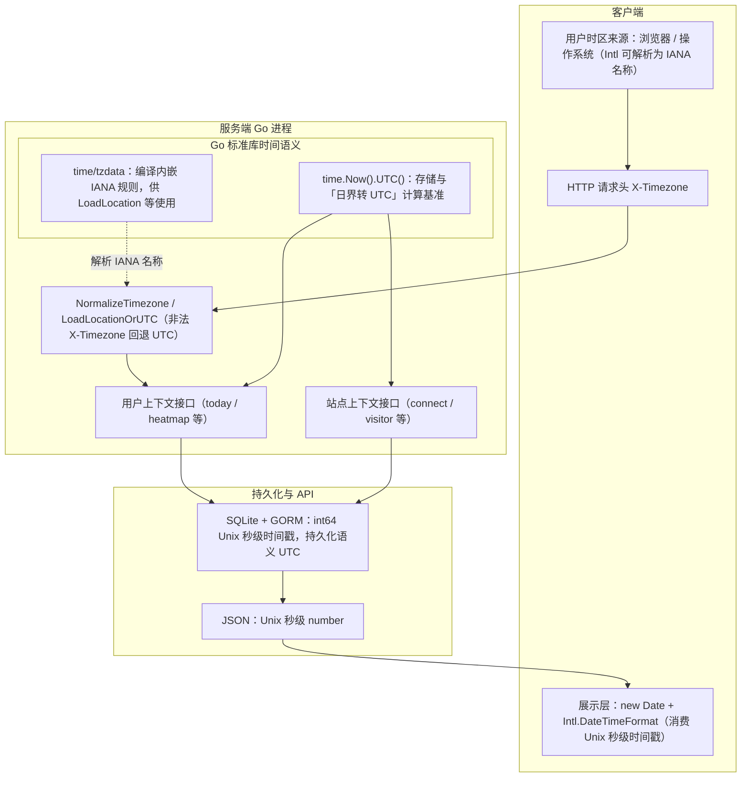

# Ech0 时间与时区设计说明

## 目标

- 保证不同时区用户看到“正确的本地时间”。
- 保证后端存储与计算语义一致，避免跨时区数据错位。
- 保持部署简单：站点级统计固定使用 UTC，不依赖运行环境 `TZ`。

## 核心原则

1. 存储层统一使用 UTC 语义（`int64` Unix 秒级时间戳）。
2. 面向“用户日历日”的接口，使用客户端上报时区（`X-Timezone`）。
3. 无用户上下文的站点级统计，固定按 UTC 日界。
4. 展示层交给浏览器本地时间能力（`Date` + `Intl.DateTimeFormat`）。

---

## 架构分层

下图按「数据流」组织：左侧是**客户端如何产生/展示时间**，中间是**服务端进程内两套时钟语义**（用户时区 vs 站点固定 UTC），右侧是**持久化与 API 序列化**。环境变量与标准库职责与下文「`tzdata`、`TZ`、`X-Timezone`」一节一致。

说明（图中未逐点画箭头，但语义成立）：

- **TZ** 不再影响站点级统计日界（固定 UTC）；不替代 `X-Timezone`。
- **`time/tzdata`** 不决定「默认用哪个时区」，只保证进程能解析 IANA 名称（与请求头校验、按用户时区算日界有关）。
- **写库**以 UTC 为准（见「存储层 UTC 语义」）；**读展示**由浏览器按用户本地时区渲染 API 返回的瞬时时刻。

---

## 分层设计细节

## 1) 存储层（Backend -> DB）

- 业务时间戳以 `int64` Unix 秒级时间戳保存，并在 JSON 中以 number 输出。
- 关键写入路径应优先使用 `time.Now().UTC().Unix()`，避免存储语义依赖机器本地时区。
- 对“按天”查询，先基于目标时区算日界，再转 UTC 进行数据库过滤。

典型场景：

- `today` 查询：目标用户时区的 `[00:00, 24:00)` 转 UTC 后查库。
- heatmap：查 UTC 区间后，再按目标时区映射到 `YYYY-MM-DD` 聚合。

## 2) API 层（Frontend -> Backend）

- 前端请求默认携带 `X-Timezone`（IANA 时区名，例如 `Asia/Shanghai`）。
- 后端通过 `NormalizeTimezone` / `LoadLocationOrUTC` 做校验与回退（非法值回退 `UTC`）。
- 该机制用于“用户视角时间语义”，如“今日内容”“热力图按天统计”。

## 3) 展示层（Frontend Render）

- 前端统一通过 `new Date(...)` 与 `Intl.DateTimeFormat(...)` 展示本地时间。
- 不在前端手写固定偏移（如 `+8`）逻辑，避免夏令时与跨地区问题。

## 4) 站点级时间语义（无用户上下文）

- `connect`、`visitor` 等无用户请求上下文的逻辑，固定使用 UTC 日界。
- 部署时无需配置 `TZ` 即可保持站点级统计口径一致。

---

## `tzdata`、`TZ`、`X-Timezone` 的职责边界

## `time/tzdata`（编译时内嵌）

- 作用：提供 IANA 时区数据库，确保程序可解析 `Asia/Shanghai`、`Europe/Berlin` 等时区名。
- 不决定“默认使用哪个时区”。

## `TZ`（部署时环境变量）

- 作用：可影响进程本地时间显示/日志等非站点统计语义。
- 不再影响站点级统计（日界固定 UTC）。

## `X-Timezone`（请求头）

- 作用：传达“当前用户的时区”。
- 影响用户视角接口，不用于全站默认时区定义。

---

## 当前项目中的推荐实践

- 用户相关接口：
  - 使用 `X-Timezone`，按用户时区计算日界（today、heatmap）。
- 站点相关接口：
  - 固定使用 UTC 日界，不依赖 `TZ`。
- 时间写入：
  - 默认使用 `time.Now().UTC()`。
- 时间展示：
  - 前端统一 `Date + Intl`。

---

## 常见错误与规避

- 错误：混用 `time.Now()` 与 `time.Now().UTC()` 写库。
  - 规避：持久化时间统一 UTC。
- 错误：按 SQL `DATE(created_at)` 直接切日。
  - 规避：先算目标时区日界再转 UTC 查询。
- 错误：前端手工写死时区偏移。
  - 规避：使用浏览器原生时区能力。
- 错误：把 `X-Timezone` 当作全站默认时区。
  - 规避：`X-Timezone` 只用于当前请求用户语义。

---

## 排障清单

当出现“今天数据不对”“热力图错天”时，按顺序检查：

1. 前端请求是否携带正确 `X-Timezone`。
2. 后端是否正确 `NormalizeTimezone`。
3. 查询是否使用“目标时区日界 -> UTC 区间”。
4. 站点级统计应固定 UTC，不应受 `TZ` 变化影响。
5. 返回 JSON 时间戳是否为 Unix 秒级 number 且可被浏览器正确解析。

---

## 测试建议（最小覆盖）

- 用例 A：`Asia/Shanghai` 用户跨 UTC 日界发布，检查 today/heatmap 是否归到本地正确日期。
- 用例 B：`America/Los_Angeles` 与 `Asia/Tokyo` 同时访问同数据，today 结果应按各自时区不同。
- 用例 C：非法 `X-Timezone`，应回退 `UTC` 且接口稳定返回。
- 用例 D：切换部署 `TZ`，验证 `connect` / `visitor` 的按天统计边界保持不变（UTC 口径）。

---

## 存储层表级审查结果（当前实现）

说明：

- 审查范围为 `internal/database/database.go` 中 `AutoMigrate` 注册的表。
- 结论口径（当前版本）：
  - “统一 UTC（自动）”：依赖 `autoCreateTime/autoUpdateTime` 自动写入 Unix 秒级时间戳。
  - “统一 UTC（业务赋值）”：字段需要业务计算（如过期/重试），由业务层手动 UTC 赋值。

| 模型（表） | 时间字段 | 当前写入行为 | 结论 |
|---|---|---|---|
| `user.UserLocalAuth` (`user_local_auth`) | `updated_at` | 自动更新时间戳 | 统一 UTC（自动） |
| `user.UserExternalIdentity` (`user_external_identities`) | `created_at`, `updated_at` | 自动时间戳 | 统一 UTC（自动） |
| `user.WebAuthnCredential` (`webauthn_credentials`) | `created_at`, `updated_at`, `last_used_at` | 自动时间戳 + 业务写入 `last_used_at`（UTC） | 统一 UTC（自动+业务） |
| `echo.Echo` (`echos`) | `created_at` | 自动时间戳 | 统一 UTC（自动） |
| `echo.EchoExtension` (`echo_extensions`) | `created_at`, `updated_at` | 自动时间戳 | 统一 UTC（自动） |
| `echo.Tag` (`tags`) | `created_at` | 自动时间戳 | 统一 UTC（自动） |
| `file.File` (`files`) | `created_at` | 自动时间戳 | 统一 UTC（自动） |
| `file.TempFile` (`temp_files`) | `expire_at`, `created_at` | `expire_at` 业务层按 UTC 计算；`created_at` 自动时间戳 | 统一 UTC（业务+自动） |
| `comment.Comment` (`comments`) | `created_at`, `updated_at` | 自动时间戳 | 统一 UTC（自动） |
| `webhook.Webhook` (`webhooks`) | `created_at`, `updated_at`, `last_trigger` | `last_trigger` 业务层 UTC；其余自动时间戳 | 统一 UTC（业务+自动） |
| `queue.DeadLetter` (`dead_letters`) | `next_retry`, `created_at`, `updated_at` | `next_retry` 业务层 UTC；其余自动时间戳 | 统一 UTC（业务+自动） |
| `migration.MigrationJob` (`migration_jobs`) | `started_at`, `finished_at`, `created_at`, `updated_at` | 迁移状态时间使用 UTC；自动时间戳 | 统一 UTC（业务+自动） |
| `setting.AccessTokenSetting` (`access_token_settings`) | `created_at`, `expiry`, `last_used_at` | `expiry` 业务层 UTC；`created_at` 自动时间戳 | 统一 UTC（业务+自动） |
| `auth.Passkey` (`passkeys`) | `created_at`, `updated_at`, `last_used_at` | 自动时间戳 | 统一 UTC（自动） |

### 审查结论

- 当前持久化模型写入路径已统一到 UTC Unix 秒级时间戳：  
  **GORM `autoCreateTime/autoUpdateTime` + 业务字段手动 UTC 秒级赋值**。
- “业务语义时间字段”（如 `ExpireAt`、`NextRetry`）继续由业务层显式计算后赋值，属于正确且必要的手动赋值。
- 历史数据若曾按本地时区写入，纠偏应通过一次性、可幂等的迁移完成，并在方案中明确“历史时刻如何解释再转 UTC”，避免重复执行造成二次平移。

### 仍需注意的边界

1. 直接执行原生 SQL 写时间字段时，不会触发 `autoCreateTime/autoUpdateTime`；需显式按 UTC 写入。
2. 非持久化结构（内存态任务状态、模板对象、测试样本）不走 GORM，需手动赋值。
3. 新增模型若包含时间字段，优先使用 `int64` + `autoCreateTime/autoUpdateTime` 约定，避免混用格式。

## 历史库升级迁移链路（v1）

升级用户首次启动时，按顺序执行以下 migrator（均有幂等键）：

1. `legacy_time_normalizer`：按配置时区将历史文本时间纠偏到 UTC 文本语义。
2. `storage_time_sanitize_migrator`：仅做低风险文本修复（空白、分隔符、`T/Z` 规范化）。
3. `storage_time_validate_migrator`：严格校验 `strftime('%s', value)` 可解析性；发现非法值即中止后续步骤。
4. `storage_time_unix_migrator`：把时间文本值转换为 Unix 秒级整数值。
5. `storage_time_schema_rebuild_migrator`：重建表结构，将目标时间列声明类型对齐为 `INTEGER`。

失败处理约定：

- 校验阶段失败时，迁移流程在当前轮次立即停止，不会继续做值转换或 schema 重建。
- 错误信息会包含非法样本（表、列、rowid、原值）以便人工修复后重启。
- 每个阶段只执行一次；修复后再次启动会从未完成阶段继续。

---

## 存储层 UTC 语义（设计约定）

- **全局时间源**：GORM `autoCreateTime/autoUpdateTime` 对 `int64` 字段使用 Unix 秒级时间戳，语义为 UTC。
- **写入一致性**：与持久化相关的路径应使用 UTC，避免“写库时刻”依赖进程本地时区。
- **窗口类逻辑**：限流、去重、滑动窗口等若与库内时间戳对比或共用同一“当前时刻”，应与存储层 UTC 语义对齐，避免基准混用。

### 手动赋值规则

为避免重复赋值与语义冲突，约定如下：

- **默认不手动赋值**：`CreatedAt` / `UpdatedAt` 等模型元数据时间，优先依赖 `autoCreateTime/autoUpdateTime` 自动处理。
- **必须手动赋值**：业务语义时间字段（例如 `ExpireAt = now + ttl`、`NextRetry = now + backoff`、事件触发时刻等）。
- **非持久化对象必须手动赋值**：内存任务状态、模板临时对象、测试构造数据等（不经 GORM，不会触发 Hook）。

判断方式：

1. 字段表示“创建/更新时间元数据” → 通常不手动填。
2. 字段表示“业务时刻 / 业务窗口 / 业务过期点” → 由业务按 UTC 显式计算并赋值。

