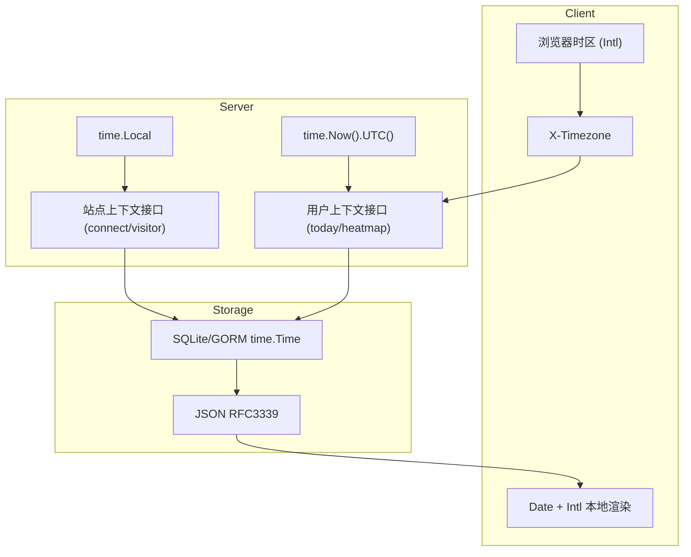

# Ech0 时间与时区设计说明

## 目标

- 保证不同时区用户看到“正确的本地时间”。
- 保证后端存储与计算语义一致，避免跨时区数据错位。
- 保持部署简单：优先复用运行环境时区（`time.Local` / `TZ`），不引入多套冲突配置。

## 核心原则

1. 存储层统一使用 UTC 语义（`time.Time` + RFC3339 序列化）。
2. 面向“用户日历日”的接口，使用客户端上报时区（`X-Timezone`）。
3. 无用户上下文的站点级统计，使用进程本地时区（`time.Local`，通常由 `TZ` 决定）。
4. 展示层交给浏览器本地时间能力（`Date` + `Intl.DateTimeFormat`）。

---

## 架构分层

---

## 分层设计细节

## 1) 存储层（Backend -> DB）

- 业务时间戳以 `time.Time` 保存，并在 JSON 中以 RFC3339 输出。
- 关键写入路径应优先使用 `time.Now().UTC()`，避免存储语义依赖机器本地时区。
- 对“按天”查询，先基于目标时区算日界，再转 UTC 进行数据库过滤。

典型场景：

- `today` 查询：目标用户时区的 `[00:00, 24:00)` 转 UTC 后查库。
- heatmap：查 UTC 区间后，再按目标时区映射到 `YYYY-MM-DD` 聚合。

## 2) API 层（Frontend -> Backend）

- 前端请求默认携带 `X-Timezone`（IANA 时区名，例如 `Asia/Shanghai`）。
- 后端通过 `NormalizeTimezone` / `LoadLocationOrUTC` 做校验与回退（非法值回退 `UTC`）。
- 该机制用于“用户视角时间语义”，如“今日内容”“热力图按天统计”。

## 3) 展示层（Frontend Render）

- 前端统一通过 `new Date(...)` 与 `Intl.DateTimeFormat(...)` 展示本地时间。
- 不在前端手写固定偏移（如 `+8`）逻辑，避免夏令时与跨地区问题。

## 4) 站点级时间语义（无用户上下文）

- `connect`、`visitor` 等无用户请求上下文的逻辑，使用 `time.Local`。
- `time.Local` 来源于运行环境（容器/系统）时区设置，通常由 `TZ` 决定。
- 若环境未配置可识别时区，按代码兜底回退 `UTC`。

---

## `tzdata`、`TZ`、`X-Timezone` 的职责边界

## `time/tzdata`（编译时内嵌）

- 作用：提供 IANA 时区数据库，确保程序可解析 `Asia/Shanghai`、`Europe/Berlin` 等时区名。
- 不决定“默认使用哪个时区”。

## `TZ`（部署时环境变量）

- 作用：决定进程本地时区（`time.Local`）。
- 影响无用户上下文的站点级逻辑。

## `X-Timezone`（请求头）

- 作用：传达“当前用户的时区”。
- 影响用户视角接口，不用于全站默认时区定义。

---

## 当前项目中的推荐实践

- 用户相关接口：
  - 使用 `X-Timezone`，按用户时区计算日界（today、heatmap）。
- 站点相关接口：
  - 使用 `time.Local`（由 `TZ`/系统时区决定）。
- 时间写入：
  - 默认使用 `time.Now().UTC()`。
- 时间展示：
  - 前端统一 `Date + Intl`。

---

## 常见错误与规避

- 错误：混用 `time.Now()` 与 `time.Now().UTC()` 写库。
  - 规避：持久化时间统一 UTC。
- 错误：按 SQL `DATE(created_at)` 直接切日。
  - 规避：先算目标时区日界再转 UTC 查询。
- 错误：前端手工写死时区偏移。
  - 规避：使用浏览器原生时区能力。
- 错误：把 `X-Timezone` 当作全站默认时区。
  - 规避：`X-Timezone` 只用于当前请求用户语义。

---

## 排障清单

当出现“今天数据不对”“热力图错天”时，按顺序检查：

1. 前端请求是否携带正确 `X-Timezone`。
2. 后端是否正确 `NormalizeTimezone`。
3. 查询是否使用“目标时区日界 -> UTC 区间”。
4. 部署环境 `TZ` 是否符合站点预期（影响 `time.Local` 语义）。
5. 返回 JSON 时间戳是否为 RFC3339 且可被浏览器正确解析。

---

## 测试建议（最小覆盖）

- 用例 A：`Asia/Shanghai` 用户跨 UTC 日界发布，检查 today/heatmap 是否归到本地正确日期。
- 用例 B：`America/Los_Angeles` 与 `Asia/Tokyo` 同时访问同数据，today 结果应按各自时区不同。
- 用例 C：非法 `X-Timezone`，应回退 `UTC` 且接口稳定返回。
- 用例 D：切换部署 `TZ`，验证 `connect` / `visitor` 的按天统计边界变化符合预期。

---

## 存储层表级审查结果（当前实现）

说明：

- 审查范围为 `internal/database/database.go` 中 `AutoMigrate` 注册的表。
- 结论口径（当前版本）：
  - “统一 UTC（自动）”：依赖 `GORM NowFunc=UTC` + 模型 Hook 自动归一。
  - “统一 UTC（业务赋值）”：字段需要业务计算（如过期/重试），由业务层手动 UTC 赋值。

| 模型（表） | 时间字段 | 当前写入行为 | 结论 |
|---|---|---|---|
| `user.UserLocalAuth` (`user_local_auth`) | `updated_at` | 自动更新时间 + Hook UTC 归一 | 统一 UTC（自动） |
| `user.UserExternalIdentity` (`user_external_identities`) | `created_at`, `updated_at` | 自动时间戳 + Hook UTC 归一 | 统一 UTC（自动） |
| `user.WebAuthnCredential` (`webauthn_credentials`) | `created_at`, `updated_at`, `last_used_at` | 自动时间戳 + 业务写入 `last_used_at`（UTC）+ Hook 归一 | 统一 UTC（自动+业务） |
| `echo.Echo` (`echos`) | `created_at` | 自动时间戳 + Hook UTC 归一 | 统一 UTC（自动） |
| `echo.EchoExtension` (`echo_extensions`) | `created_at`, `updated_at` | 自动时间戳 + Hook UTC 归一 | 统一 UTC（自动） |
| `echo.Tag` (`tags`) | `created_at` | 自动时间戳 + Hook UTC 归一 | 统一 UTC（自动） |
| `file.File` (`files`) | `created_at` | 自动时间戳 + Hook UTC 归一 | 统一 UTC（自动） |
| `file.TempFile` (`temp_files`) | `expire_at`, `created_at` | `expire_at` 业务层按 UTC 计算；`created_at` 自动时间戳 + Hook | 统一 UTC（业务+自动） |
| `comment.Comment` (`comments`) | `created_at`, `updated_at` | 自动时间戳 + Hook UTC 归一 | 统一 UTC（自动） |
| `webhook.Webhook` (`webhooks`) | `created_at`, `updated_at`, `last_trigger` | `last_trigger` 业务层 UTC；其余自动时间戳 + Hook | 统一 UTC（业务+自动） |
| `queue.DeadLetter` (`dead_letters`) | `next_retry`, `created_at`, `updated_at` | `next_retry` 业务层 UTC；其余自动时间戳 + Hook | 统一 UTC（业务+自动） |
| `migration.MigrationJob` (`migration_jobs`) | `started_at`, `finished_at`, `created_at`, `updated_at` | 迁移状态时间使用 UTC；自动时间戳 + Hook | 统一 UTC（业务+自动） |
| `setting.AccessTokenSetting` (`access_token_settings`) | `created_at`, `expiry`, `last_used_at` | `expiry` 业务层 UTC；`created_at` 自动时间戳 + Hook（兼容显式场景） | 统一 UTC（业务+自动） |
| `auth.Passkey` (`passkeys`) | `created_at`, `updated_at`, `last_used_at` | 自动时间戳 + Hook UTC 归一 | 统一 UTC（自动） |

### 审查结论

- 当前持久化模型写入路径已统一到 UTC：  
  **GORM 全局 `NowFunc=UTC` + 模型 Hook UTC 归一 + 业务字段手动 UTC 赋值**。
- “业务语义时间字段”（如 `ExpireAt`、`NextRetry`）继续由业务层显式计算后赋值，属于正确且必要的手动赋值。
- 历史数据通过一次性归一迁移处理（基准时区 `Asia/Shanghai`，带幂等标记）。

### 仍需注意的边界

1. 直接执行原生 SQL 写时间字段时，不会自动触发模型 Hook；需显式按 UTC 写入。
2. 非持久化结构（内存态任务状态、模板对象、测试样本）不走 GORM，需手动赋值。
3. 新增模型若包含时间字段，需接入统一 Hook 约定，避免遗漏。

---

## 未来演进建议

- 为时区关键路径补充可读日志（输入时区、计算出的日界区间、最终 UTC 区间）。
- 增加集成测试矩阵（多时区 + 夏令时切换日）。
- 对站点级统计行为在运维文档中给出明确 `TZ` 示例。

---

## UTC 统一改造（已落地）

本项目已完成“存储层 UTC 统一”第一阶段改造，规则如下：

- GORM 全局 `NowFunc` 统一为 `time.Now().UTC()`，自动时间戳默认使用 UTC。
- 关键写入路径（评论、文件临时记录、Passkey、Webhook 更新等）补齐显式 UTC 赋值。
- 评论限流/去重的时间窗口计算改为 UTC 基准，避免与存储语义错位。

### 历史数据一次性归一

- 启动时会自动尝试执行一次归一流程（基于幂等标记自动跳过重复转换，无公开 CLI 入口）。
- 行为：
  1. 启动后检查幂等标记，未完成则执行归一；
  2. 按 `Asia/Shanghai` 解释历史时间并转换为 UTC；
  3. 写入幂等标记，重复执行会自动跳过；
  4. 输出逐表逐字段的候选行与更新行统计（审计信息）。

### 幂等与安全约定

- 幂等标记键：`storage_time_utc_normalized_v1`（存于 `key_values`）。
- 若标记存在，迁移命令仅做信息输出，不会二次平移历史时间。
- 若首次启动触发归一，建议在低峰时段完成部署并观察日志中的统计结果。

### 手动赋值规则（必须遵守）

为避免“重复赋值 + 语义冲突”，统一规则如下：

- **默认不手动赋值**：`CreatedAt/UpdatedAt` 这类模型元数据时间，优先依赖  
  `GORM NowFunc=UTC + 模型 Hook` 自动处理。
- **必须手动赋值**：业务语义时间字段（例如 `ExpireAt = now + ttl`、`NextRetry = now + backoff`、事件触发时间等）。
- **非持久化对象必须手动赋值**：内存任务状态、通知模板临时对象、测试样本构造等（不走 GORM，不会触发 Hook）。

推荐判断法：

1. 字段语义是“创建/更新时间元数据” -> 通常不手动填。
2. 字段语义是“业务时刻/业务窗口/业务过期点” -> 必须手动算。

