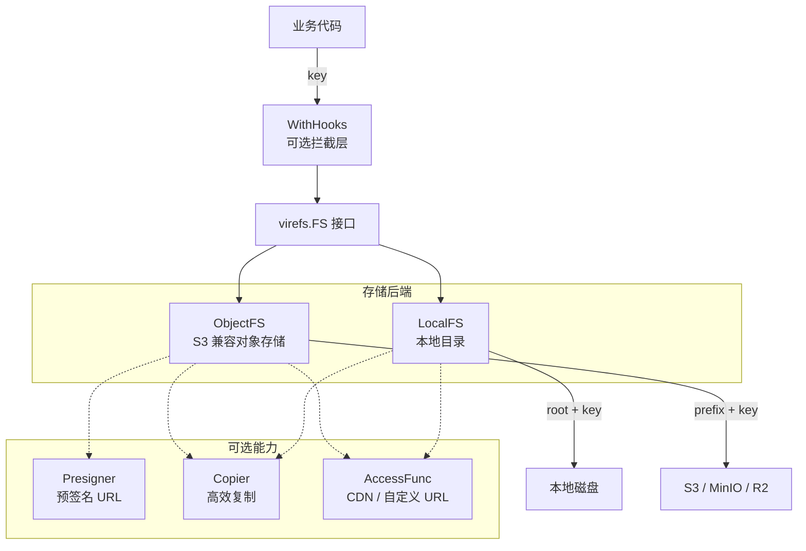
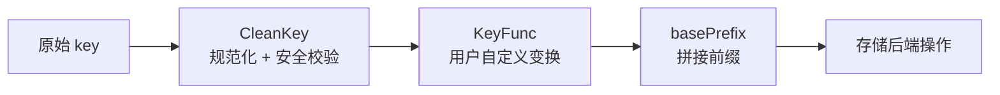

# VireFS

**VireFS** 是一个极简的 Go 文件系统抽象库。

它将**本地文件系统**和 **S3 兼容的对象存储**统一到同一套接口之下——你的业务代码只跟 `key` 打交道，不关心文件存在磁盘上还是云端。

---

## 定位

> **一句话**：用 key 管理文件，后端透明。

典型使用场景：你的项目既有本地文件（用户上传暂存、导出报表等），又有对象存储里的文件（图片、视频、备份等），文件的 key 存在你的数据库里，通过 VireFS 用同一套 API 操作它们。

```
你的业务代码 ──key──▶ VireFS ──▶ 本地磁盘 / S3 / MinIO / R2 / ...
```

## 架构



## 核心概念

### Key

所有操作以 `key` 为寻址核心。key 是以 `/` 分隔的路径，例如 `photos/2026/cat.jpg`。

- 自动清理首尾 `/`、合并重复 `/`、解析 `.`
- 禁止 `..` 跳出，保证安全

### FS 接口

```go
type FS interface {
    Get(ctx, key)                        // 读取文件内容
    Put(ctx, key, reader, ...PutOption)  // 写入（支持 ContentType、Metadata）
    Delete(ctx, key)                     // 删除
    List(ctx, prefix)                    // 按前缀列举
    Stat(ctx, key)                       // 获取元信息
    Access(ctx, key)                     // 获取外部访问路径/URL
    Exists(ctx, key)                     // 检查 key 是否存在
}
```

### 后端

| 后端 | 构造函数 | root 概念 |
|---|---|---|
| **LocalFS** | `NewLocalFS(rootDir, ...LocalOption) (*LocalFS, error)` | 指定的本地目录 |
| **ObjectFS** | `NewObjectFS(s3Client, bucket, ...ObjectOption)` | endpoint + bucket |

### 可选能力（类型断言）

| 接口 | 说明 | 实现者 |
|---|---|---|
| `Presigner` | 生成预签名上传/下载 URL | ObjectFS |
| `Copier` | 同后端高效复制 | LocalFS, ObjectFS, MountTable |
| `BatchDeleter` | 批量删除 | ObjectFS（S3 DeleteObjects） |

### 错误模型

| 哨兵错误 | 含义 |
|---|---|
| `ErrNotFound` | key 不存在 |
| `ErrInvalidKey` | key 包含非法模式（如 `..`） |
| `ErrAlreadyExist` | 资源已存在（保留） |
| `ErrNotSupported` | 当前后端不支持此操作 |
| `ErrPermission` | 权限不足 |

所有后端错误都被包装为 `*OpError{Op, Key, Err}`，方便定位问题。

## 快速上手

### 本地文件系统

```go
package main

import (
    "context"
    "fmt"
    "io"
    "log"
    "strings"

    "github.com/lin-snow/ech0/pkg/virefs"
)

func main() {
    ctx := context.Background()
    fs, err := virefs.NewLocalFS("/tmp/mydata", virefs.WithCreateRoot())
    if err != nil {
        log.Fatal(err)
    }

    // 写入
    if err := fs.Put(ctx, "hello.txt", strings.NewReader("world")); err != nil {
        log.Fatal(err)
    }

    // 读取
    rc, err := fs.Get(ctx, "hello.txt")
    if err != nil {
        log.Fatal(err)
    }
    defer rc.Close()
    data, _ := io.ReadAll(rc)
    fmt.Println(string(data)) // "world"

    // 获取本地路径
    info, err := fs.Access(ctx, "hello.txt")
    if err != nil {
        log.Fatal(err)
    }
    fmt.Println(info.Path) // "/tmp/mydata/hello.txt"
}
```

### 对象存储（S3 / MinIO / R2）

**推荐：一步到位的便捷构造器**

```go
fs, err := virefs.NewObjectFSFromConfig(ctx, &virefs.S3Config{
    Provider:  virefs.ProviderMinIO,
    Endpoint:  "http://localhost:9000",
    Region:    "us-east-1",
    AccessKey: "minioadmin",
    SecretKey: "minioadmin",
    Bucket:    "my-bucket",
}, virefs.WithPrefix("uploads/"))
```

内置 Provider 预设自动处理各平台怪癖：

| Provider | 行为 |
|---|---|
| `ProviderAWS` | 默认配置，虚拟主机风格，默认 region `us-east-1`；保留 SDK 默认的 checksum 完整性校验 |
| `ProviderMinIO` | 自动启用 `UsePathStyle` |
| `ProviderR2` | 自动启用 `UsePathStyle`，默认 region `auto` |

> 所有非 AWS 目标（任意非 `ProviderAWS`，或带自定义 `Endpoint` 的 `ProviderAWS`）都会把
> `RequestChecksumCalculation` 与 `ResponseChecksumValidation` 降为 `WhenRequired`，
> 关闭 aws-sdk-go-v2 (s3 v1.74.1+) 默认的 aws-chunked trailer checksum —— 多数 S3 兼容服务
> （MinIO / R2 / Backblaze / Ceph …）会以 `XAmzContentSHA256Mismatch` 或 "chunk too big" 拒收它。

也可以自行构建 `*s3.Client`（完全控制）：

```go
client, err := virefs.NewS3Client(ctx, &virefs.S3Config{
    Provider:  virefs.ProviderR2,
    Endpoint:  "https://<account-id>.r2.cloudflarestorage.com",
    AccessKey: os.Getenv("R2_ACCESS_KEY"),
    SecretKey: os.Getenv("R2_SECRET_KEY"),
})

fs := virefs.NewObjectFS(client, "my-bucket", virefs.WithPrefix("uploads/"))
```

上传并指定 ContentType：

```go
if err := fs.Put(ctx, "photo.jpg", file,
    virefs.WithContentType("image/jpeg"),
    virefs.WithMetadata(map[string]string{"user": "alice"}),
); err != nil {
    log.Fatal(err)
}
```

## 功能详解

### Put 选项：ContentType 和 Metadata

ObjectFS 会将这些信息传递给 S3 PutObject；LocalFS 会忽略它们（本地文件系统无此概念）。

```go
err := fs.Put(ctx, "report.pdf", file,
    virefs.WithContentType("application/pdf"),
    virefs.WithMetadata(map[string]string{"version": "2"}),
)
```

### Exists — 检查 key 是否存在

`Exists` 是 `FS` 接口方法，各后端有最优实现（S3 用 `HeadObject`，本地用 `os.Stat`）。
也保留了包级别便捷函数：

```go
// 接口方法
ok, err := fs.Exists(ctx, "maybe.txt")

// 包级别函数（等价）
ok, err = virefs.Exists(ctx, fs, "maybe.txt")
```

### Copy — 文件复制

同后端复制走原生高效路径（S3 `CopyObject`、本地文件复制），跨后端自动退化为 `Get` + `Put`。

```go
// 同后端（S3 内部复制，无需下载再上传）
err := virefs.Copy(ctx, objFS, "src.txt", objFS, "dst.txt")

// 跨后端（本地 → S3）
err = virefs.Copy(ctx, localFS, "export.csv", objFS, "imports/export.csv",
    virefs.WithContentType("text/csv"),
)
```

### Access — 获取外部访问信息

核心 FS 接口方法，根据后端返回不同内容。`Path` 和 `URL` 可以同时存在。

| 后端 | `AccessInfo.Path` | `AccessInfo.URL` |
|---|---|---|
| LocalFS（无 AccessFunc） | 绝对文件路径 | 空 |
| LocalFS（有 AccessFunc） | 绝对文件路径 | AccessFunc 生成的 URL |
| ObjectFS | 空 | 预签名/公开/CDN URL |

```go
// LocalFS — 同时获取磁盘路径和 HTTP URL
localFS, _ := virefs.NewLocalFS("/data/files",
    virefs.WithLocalAccessFunc(func(key string) *virefs.AccessInfo {
        return &virefs.AccessInfo{URL: "https://cdn.example.com/files/" + key}
    }),
)
info, _ := localFS.Access(ctx, "images/logo.png")
fmt.Println(info.Path) // "/data/files/images/logo.png"
fmt.Println(info.URL)  // "https://cdn.example.com/files/images/logo.png"

// ObjectFS（自动选择：AccessFunc > Presign > BaseURL）
info, err = objFS.Access(ctx, "doc.pdf")
fmt.Println(info.URL)
```

ObjectFS 自定义 CDN 域名：

```go
fs := virefs.NewObjectFS(client, "bucket",
    virefs.WithPrefix("assets/"),
    virefs.WithAccessFunc(func(key string) *virefs.AccessInfo {
        return &virefs.AccessInfo{URL: "https://cdn.example.com/" + key}
    }),
)
// Access("img/logo.png") → "https://cdn.example.com/assets/img/logo.png"
```

### 预签名 URL

通过 `Presigner` 可选接口，使用类型断言获取预签名能力：

```go
fs := virefs.NewObjectFS(client, "bucket",
    virefs.WithPresignClient(s3.NewPresignClient(client)),
)

if p, ok := fs.(virefs.Presigner); ok {
    get, err := p.PresignGet(ctx, "secret.pdf", 15*time.Minute)
    put, err := p.PresignPut(ctx, "upload.zip", 30*time.Minute)
    fmt.Println(get.URL, put.URL, err)
}
```

### 原子写入（LocalFS）

启用后 Put 先写临时文件，再原子 rename，防止并发写入数据损坏。

```go
fs, _ := virefs.NewLocalFS("/data", virefs.WithAtomicWrite())
```

### Key 变换（KeyFunc）

在 `CleanKey` 之后、实际存储操作之前，对 key 进行自定义变换：

```go
fs, _ := virefs.NewLocalFS("/data", virefs.WithLocalKeyFunc(func(key string) string {
    return time.Now().Format("2006/01/02") + "/" + key
}))
// Put("photo.jpg") → 实际写入 /data/2026/03/06/photo.jpg
```

### Schema — 声明式文件组织

用户数据库里只存简单的文件名（如 `cat.jpg`），但希望实际存储时按业务规则分目录。Schema 提供声明式的路由规则，按扩展名或自定义函数将文件归类到不同目录前缀。

```go
schema := virefs.NewSchema(
    virefs.RouteByExt("images/", ".jpg", ".jpeg", ".png", ".gif", ".webp"),
    virefs.RouteByExt("videos/", ".mp4", ".avi", ".mkv"),
    virefs.RouteByExt("docs/",   ".pdf", ".doc", ".docx"),
    virefs.DefaultRoute("other/"),
)

// 通过 WithLocalKeyFunc / WithObjectKeyFunc 接入
fs, _ := virefs.NewLocalFS("/data", virefs.WithLocalKeyFunc(schema.Resolve))

fs.Put(ctx, "cat.jpg", r)       // → /data/images/cat.jpg
fs.Put(ctx, "report.pdf", r)    // → /data/docs/report.pdf
fs.Put(ctx, "readme.txt", r)    // → /data/other/readme.txt
```

对象存储同理：

```go
objFS := virefs.NewObjectFS(client, "bucket",
    virefs.WithPrefix("uploads/"),
    virefs.WithObjectKeyFunc(schema.Resolve),
)
// Put("cat.jpg") → S3 key: uploads/images/cat.jpg
```

路由规则按声明顺序匹配，第一个命中的生效。支持自定义匹配函数：

```go
virefs.RouteByFunc("archives/", func(key string) bool {
    return strings.HasSuffix(key, ".tar.gz") || strings.HasSuffix(key, ".zip")
})
```

### Walk — 递归遍历

递归列举 prefix 下的所有文件和目录（基于 `List` 的浅层语义递归展开）：

```go
err := virefs.Walk(ctx, fs, "", func(key string, info virefs.FileInfo, err error) error {
    if err != nil {
        return err
    }
    fmt.Println(key, info.Size)
    return nil
})
```

返回 `virefs.ErrSkipDir` 可跳过指定子目录。

### BatchDelete — 批量删除

ObjectFS 使用 S3 `DeleteObjects` 实现高效批量删除，其他后端自动退化为逐个删除：

```go
err := virefs.BatchDelete(ctx, fs, []string{"a.txt", "b.txt", "c.txt"})
```

### Migrate — 批量迁移

`Migrate` 递归复制文件，支持冲突策略、DryRun、进度回调和 key 变换：

```go
result, err := virefs.Migrate(ctx, srcFS, "old-data", dstFS, "new-data",
    virefs.WithConflictPolicy(virefs.ConflictSkip),
    virefs.WithProgressFunc(func(p virefs.MigrateProgress) {
        fmt.Printf("[%d/%d] %s\n", p.Copied+p.Skipped, p.Total, p.Key)
    }),
)
fmt.Printf("copied=%d skipped=%d total=%d\n", result.Copied, result.Skipped, result.Total)
```

冲突策略：

| 策略 | 行为 |
|---|---|
| `ConflictError` | 遇到已存在的 key 立即返回错误（默认） |
| `ConflictSkip` | 跳过已存在的 key |
| `ConflictOverwrite` | 覆盖已存在的 key |

DryRun 模式只遍历不复制，报告将会发生的操作：

```go
result, _ := virefs.Migrate(ctx, src, "", dst, "",
    virefs.WithDryRun(),
    virefs.WithConflictPolicy(virefs.ConflictSkip),
)
```

Key 变换——迁移时重命名文件：

```go
virefs.WithMigrateKeyFunc(func(key string) string {
    return "v2/" + key
})
```

### Stat — 获取文件元信息（含 ContentType）

`Stat` 返回的 `FileInfo` 包含 `ContentType` 字段，所有后端行为一致：

- **ObjectFS**：从 S3 `HeadObject` 响应中读取真实的 Content-Type
- **LocalFS**：通过文件扩展名推断（基于标准库 `mime.TypeByExtension`）

```go
info, _ := fs.Stat(ctx, "photos/cat.jpg")

fmt.Println(info.Key)         // "photos/cat.jpg"
fmt.Println(info.Size)        // 102400
fmt.Println(info.ContentType) // "image/jpeg"

// 直接用于填充业务数据库
db.Exec("INSERT INTO files (key, size, content_type) VALUES (?, ?, ?)",
    info.Key, info.Size, info.ContentType)
```

### WithHooks — 操作拦截

`WithHooks` 可以给任意 FS 添加拦截逻辑，无需手写 6 个方法的转发样板。所有 hook 字段可选，nil 表示不拦截。

```go
hfs := virefs.WithHooks(fs, virefs.Hooks{
    // 包装 Get 返回的 reader（用于计算 hash、解密等）
    WrapGet: func(key string, rc io.ReadCloser) io.ReadCloser {
        return myHashReader(rc)
    },
    // 包装 Put 的输入 reader（用于加密、压缩等）
    WrapPut: func(key string, r io.Reader) io.Reader {
        return myEncryptReader(r)
    },
    // Stat 成功后修改 FileInfo（用于补充信息）
    AfterStat: func(key string, info *virefs.FileInfo) {
        info.ContentType = "custom/override"
    },
    // Delete 成功后回调（用于日志、缓存清理等）
    OnDelete: func(key string) {
        log.Printf("deleted: %s", key)
    },
})

// 像普通 FS 一样使用，hook 自动生效
rc, _ := hfs.Get(ctx, "secret.dat")  // WrapGet 自动应用
hfs.Put(ctx, "encrypted.bin", data)   // WrapPut 自动应用

// 需要访问底层 FS 的可选接口时，通过 Unwrap 获取
inner := hfs.Unwrap()
if p, ok := inner.(virefs.Presigner); ok {
    req, _ := p.PresignGet(ctx, "file.txt", 15*time.Minute)
    fmt.Println(req.URL)
}
```

### Chain — 中间件链

需要同时做日志、加密、限速等多层拦截时，使用 `Chain` + `Middleware` 组合多个层。
中间件按声明顺序依次包裹，最后一个中间件处于最外层（调用者最先触达）：

```go
fs := virefs.Chain(baseFS,
    encryptionMiddleware(key),    // 内层：靠近 baseFS
    loggingMiddleware(logger),    // 外层：调用者最先触达
)
```

编写自定义中间件：嵌入 `BaseFS`，只覆盖需要拦截的方法：

```go
type metricsFS struct {
    virefs.BaseFS
    counter *atomic.Int64
}

func (m *metricsFS) Get(ctx context.Context, key string) (io.ReadCloser, error) {
    m.counter.Add(1)
    return m.Inner.Get(ctx, key)
}

func metricsMiddleware(counter *atomic.Int64) virefs.Middleware {
    return func(next virefs.FS) virefs.FS {
        return &metricsFS{BaseFS: virefs.BaseFS{Inner: next}, counter: counter}
    }
}
```

`WithHooks` 可以直接在 `Chain` 中使用——它本身就是一个中间件：

```go
fs := virefs.Chain(baseFS,
    func(next virefs.FS) virefs.FS {
        return virefs.WithHooks(next, virefs.Hooks{
            OnDelete: func(key string) { log.Println("deleted:", key) },
        })
    },
    metricsMiddleware(counter),
)
```

### MountTable — 多后端路由（可选）

当需要通过单个 `FS` 接口操作多个后端时，使用 MountTable 按前缀路由：

```go
mt := virefs.NewMountTable()
local, _ := virefs.NewLocalFS("/data/files")
mt.Mount("local", local)
mt.Mount("s3",    virefs.NewObjectFS(s3Client, "my-bucket"))

mt.Get(ctx, "local/reports/q1.csv")  // → LocalFS
mt.Put(ctx, "s3/images/logo.png", r) // → ObjectFS
```

## Key 处理流水线



## 完整 Option 速查

### LocalFS

| Option | 说明 |
|---|---|
| `WithCreateRoot()` | root 目录不存在时自动创建 |
| `WithDirPerm(perm)` | 自动创建目录的权限（默认 0755） |
| `WithLocalKeyFunc(fn)` | key 变换函数 |
| `WithAtomicWrite()` | 启用原子写入 |
| `WithLocalAccessFunc(fn)` | 自定义 Access URL 生成（Path + URL 同时返回） |

### ObjectFS

| Option | 说明 |
|---|---|
| `WithPrefix(p)` | 所有 key 添加前缀 |
| `WithObjectKeyFunc(fn)` | key 变换函数 |
| `WithPresignClient(pc)` | 启用预签名 URL |
| `WithBaseURL(url)` | Access 公开 URL 基地址 |
| `WithAccessExpires(d)` | Access 预签名默认过期时间 |
| `WithAccessFunc(fn)` | 自定义 Access URL 生成 |

### Put

| Option | 说明 |
|---|---|
| `WithContentType(ct)` | 设置 MIME 类型 |
| `WithMetadata(m)` | 设置自定义元数据 |

